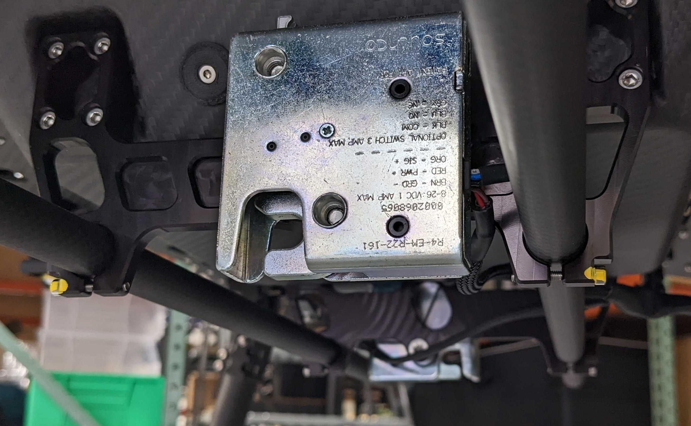
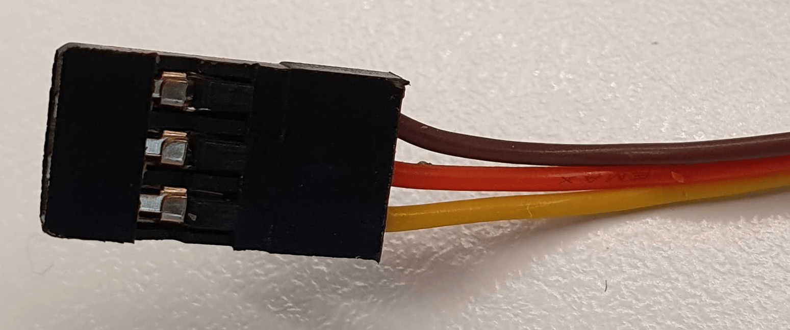
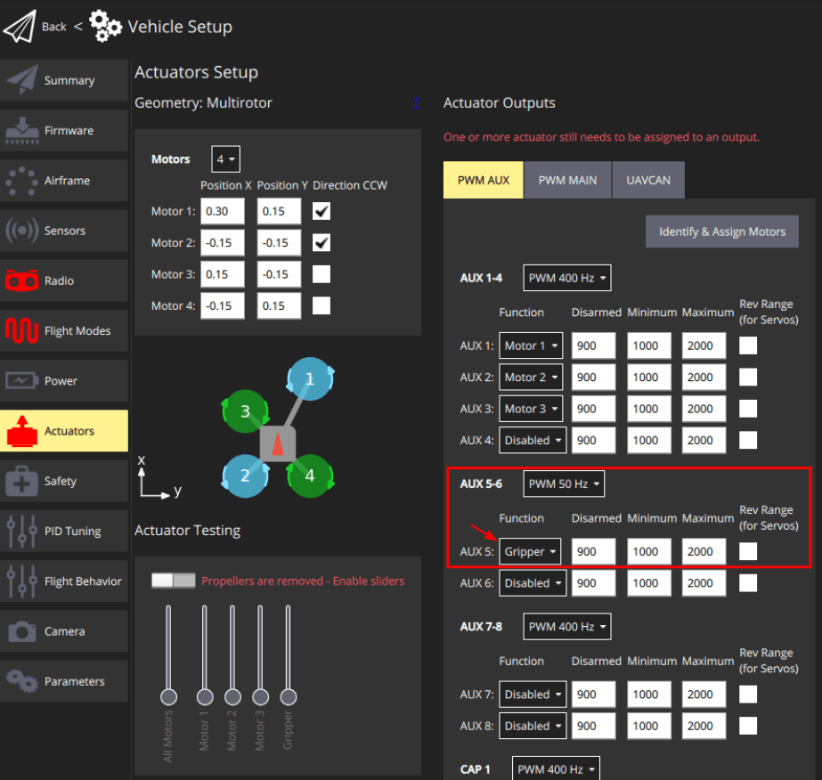

# PWM Servo Gripper

This section explains how to connect and configure a [gripper](../peripherals/gripper.md) that is controlled using a flight controller PWM output (a servo actuator).

## Supported Grippers

The following PWM-connected servos have been tested with PX4:

- [R4-EM-R22-161 : push-to-close latch electronic lock](https://southco.com/en_any_int/r4-em-r22-161).

## Connecting a PWM-controlled Gripper

The PWM cable comprises of three lines: power, ground and signal.
A typical connector is shown in the image below:

In the image above the wire colors have the following meanings:

| Wire color | Purpose    |
| ---------- | ---------- |
| Brown      | Ground     |
| Red        | 电源         |
| Yellow     | PWM Signal |

You would need to connect them into a PWM input of the Flight controller appropriately.

### Compatibility Checks

Before connecting the cable, double-check the following requirements:

- **Signal line voltage level**: Check the data-sheet of your gripper mechanism to find the voltage level of the signal line. And make sure this is compatible with the voltage level of the pins of your Flight Controller.
- **Power requirements of gripper**: Check the mechanism's data-sheet to find out the power line voltage level requirements. Depending on that, the gripper can be either connected directly to the [power module](../power_module/index.md) or connected to a 5V line.
  Alternatively a custom voltage regulator can be used to output any other voltage required.

## PX4 配置

Configuration instructions can be found in: [Gripper > PX4 Configuration](../peripherals/gripper.md#px4-configuration) documentation.

In particular, note that a servo gripper must be mapped to an output as shown below.

### Actuator Mapping

PWM servo grippers, and other peripherals connected directly to PWM outputs, must be mapped to specific outputs during [Actuator Configuration](../config/actuators.md#actuator-outputs).

This is done by assigning the `Gripper` function to the to the output port where the gripper is connected.
For example, the image below assigns `Gripper` to the PWM AUX5 output.

You must also set the correct PWM frequency for the gripper output port(for commercial servos / grippers this is normally 50Hz).

:::info
Mis-configuring the frequency may damaging the gripper.
:::

The sliders in the [Actuator Testing](../config/actuators.md#actuator-testing) section of the configuration screen can be used to verify that the correct output moves when you move the slider.
The minimum and maximum PWM values should be set such that the servo is fully closed in the disarmed position and fully open at the maximum slider position.
