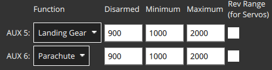

# 降落伞

PX4 can be configured to trigger a parachute during [flight termination](../advanced_config/flight_termination.md).

The parachute can be connected to a free PWM output or via MAVLink.

:::info
During flight termination PX4 turns off all controllers and sets all PWM outputs to their failsafe values (including those connected to PWM outputs) and triggers any connected MAVLink parachutes.

You can therefore use this feature to activate multiple complementary safety devices connected to different outputs.
For more information see [Flight Termination Configuration](../advanced_config/flight_termination.md).
:::

## Using Parachutes

Below are a few considerations when using parachutes:

- A parachute does not guarantee that the vehicle will not be destroyed or cause harm!
  You must always fly with safety in mind.
- Parachutes require careful usage to be effective.
  For example, they must be folded correctly.
- Parachutes have a minimum effective altitude.
- A parachute may trigger while the vehicle is upside down.
  This will increase the time required to slow, and may result in the drone collapsing the parachute.
- The parachute will only deploy if the flight controller is powered and PX4 is running properly (unless it is triggered independently of PX4).
  It will not deploy if something causes the flight stack to crash.

## Parachute Setup

Flight termination (and hence parachute deployment) may be triggered by safety checks such as RC Loss, geofence violation, and so on, from attitude triggers and other failure detector checks, or by a command from a ground station.
During flight termination PX4 sets PWM outputs to their "failsafe" values (failsafe values turn off motors, but may be used to turn on/trigger the parachute).
If a MAVLink parachute is connected and healthy, a command will be sent to activate it.

Parachute setup therefore involves:

- Configuring [flight termination](../advanced_config/flight_termination.md) as the appropriate action for those safety and failure cases where the parachute should be deployed.
- Configure PX4 to deploy the parachute during flight termination (set PWM output levels appropriately or send the MAVLink parachute deploy command).
- Configure PX4 output levels to disable motors on failsafe.
  This is the default so usually nothing is required (for servos it's the center value).

### Enable Flight Termination

To enable flight termination:

- Set [Safety](../config/safety.md) action to _Flight termination_ for checks where you want the parachute to trigger.
- Set [Failure Detector](../config/safety.md#failure-detector) pitch angles, roll angles and time triggers for crash/flip detection, and disable the failure/IMU timeout circuit breaker (i.e. set [CBRK_FLIGHTTERM=0](../advanced_config/parameter_reference.md#CBRK_FLIGHTTERM)).

:::info
You can also configure an [external Automatic Trigger System (ATS)](../config/safety.md#external-automatic-trigger-system-ats) for failure detection.
:::

### Parachute Output Bus Setup

If the parachute is triggered by a PWM or CAN output then it must first be connected to an unused output.
You will probably also need to separately power the parachute servo.
This is might be done by connecting a 5V BEC to the Flight Controller servo rail, and powering the parachute from it.

You then need to ensure that the parachute pin will be set to a value that will trigger the parachute when a failsafe occurs:

- Open [Actuators](../config/actuators.md) in QGroundControl

- Assign the _Parachute_ function to any unused output (below we set the `AUX6` output):

  

- Set appropriate PWM values for your parachute.
  The output is automatically set to the maximum PWM value when a failsafe is triggered.

  ::: info
  For the spring-loaded launcher from [Fruity Chutes](https://fruitychutes.com/buyachute/drone-and-uav-parachute-recovery-c-21/harrier-drone-parachute-launcher-c-21_33/) the minimum PWM value should be between 700 and 1000ms, and the maximum value between 1800 and 2200ms.

:::

### MAVLink Parachute Setup

PX4 will trigger a connected and healthy parachute on failsafe by sending the command [MAV_CMD_DO_PARACHUTE](https://mavlink.io/en/messages/common.html#MAV_CMD_DO_PARACHUTE) with the [PARACHUTE_RELEASE](https://mavlink.io/en/messages/common.html#PARACHUTE_ACTION) action.

MAVLink parachute support is enabled by setting the parameter [COM_PARACHUTE=1](../advanced_config/parameter_reference.md#COM_PARACHUTE).
PX4 will then indicate parachute status using the [MAV_SYS_STATUS_RECOVERY_SYSTEM](https://mavlink.io/en/messages/common.html#MAV_SYS_STATUS_RECOVERY_SYSTEM) bit in the [SYS_STATUS](https://mavlink.io/en/messages/common.html#SYS_STATUS) extended onboard control sensors fields:

- `SYS_STATUS.onboard_control_sensors_present_extended`: MAVLink parachute present (based on heartbeat detection).
- `SYS_STATUS.onboard_control_sensors_enabled_extended`: ?
- `SYS_STATUS.onboard_control_sensors_health_extended`: MAVLink parachute healthy (based on heartbeat detection).

A MAVLink parachute is required to emit a [HEARTBEAT](https://mavlink.io/en/messages/common.html#HEARTBEAT) with `HEARTBEAT.type` of [MAV_TYPE_PARACHUTE](https://mavlink.io/en/messages/common.html#MAV_TYPE_PARACHUTE).

<!-- PX4 v1.13 support added here: https://github.com/PX4/PX4-Autopilot/pull/18589 -->

## Parachute Testing

:::warning
For the first test, try on the bench, without the props and with an unloaded parachute device!
:::

:::info
There is no way to recover from a Termination state!
You will need to reboot/power cycle the vehicle for subsequent tests.
:::

The parachute will trigger during [flight termination](../advanced_config/flight_termination.md).

The easiest way to test a (real) parachute is to enable the [failure detector attitude trigger](../config/safety.md#attitude-trigger) and tip the vehicle over.

You can also simulate a parachute/flight termination: [Gazebo Classic > Simulated Parachute/Flight Termination](../sim_gazebo_classic/index.md#simulated-parachute-flight-termination).
