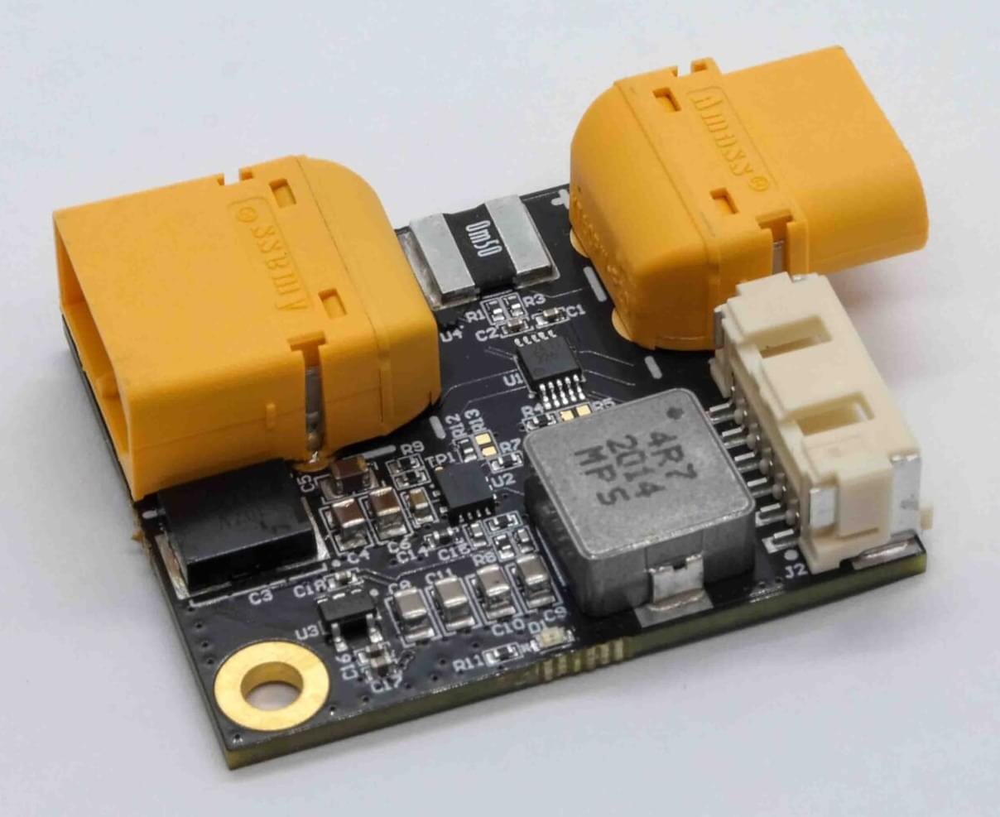

# ARK PAB Power Module

The [ARK PAB Power Module](https://arkelectron.gitbook.io/ark-documentation/power/ark-pab-power-module) is an advanced power module rated for 60A continuous battery current at 20°C ambient.
For higher continuous current needs, running multiple power modules in parallel is recommended.
Note that at 60A and 20°C without cooling, the 5V regulator is de-rated to a 3A continuous output.

## 购买渠道

Order this module from:

- [ARK Electronics](https://arkelectron.com/product/ark-pab-power-module/) (US)

## Hardware Specifications

- **TI INA226 Digital Power Monitor**

  - 0.0005 Ohm Shunt
  - I2C Interface

- **5.2V 6A Step-Down Regulator**

  - 33V Maximum Input Voltage
  - 5.8V Minimum Input Voltage at 6A Out
  - Output Over-Voltage Protection
  - Output Over-Current Protection

- **Connections**

  - XT60 Battery Input
  - XT60 Battery Output
  - 6 Pin Molex CLIK-Mate Output
    - [Matches ARK PAB Carrier Power Pinout](https://arkelectron.gitbook.io/ark-documentation/flight-controllers/ark-pixhawk-autopilot-bus-carrier/pinout)

- **Other**

  - USA Built
  - FCC Compliant
  - Includes 6 Pin Molex CLIK-Mate Cable

- **Additional Information**
  - Weight: 17.9 g
  - Dimensions: 4.75 cm x 3.43 cm x 1.15 cm

## PX4 Setup

- Enable the SENS_EN_INA226 parameter if it not enabled.
- Reboot the flight controller.

## See Also

- [ARK PAB Power Module Documentation](https://arkelectron.gitbook.io/ark-documentation/power/ark-pab-power-module) (ARK Docs)
