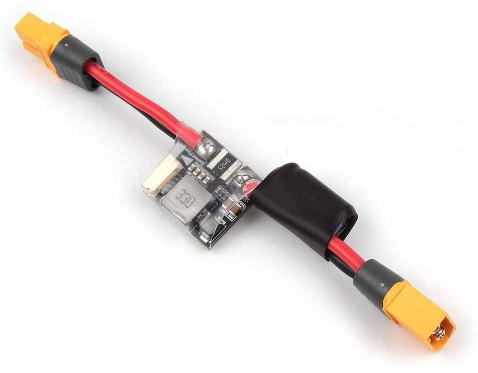

# Holybro PM02 (V3) Power Module

This analog power module provides regulated power to flight controller and power distribution board, and sends information to the autopilot about battery voltage and current supplied to the flight controller and the motors.
It is commonly used with [Pixhawk 4](../assembly/quick_start_pixhawk4.md).

:::info
The module can be used with other flight controllers that require an analog power module, including [Durandal](../flight_controller/durandal.md), [Pix32 v5](../flight_controller/holybro_pix32_v5.md), etc
:::

## 产品规格

- **Rated current**: 60A
- **Max current**: 120A (<60 Sec)
- **Max current sensing**: 120A
- **Battery supported**: up to 12S battery
- **Communication protocol**: Analog
- **Switching regulator outputs**: 5.2V and 3A max
- **Weight**: 20g

Voltage and current measurement configured for 3.3V ADC

## Package Contents

- Power Module with XT60 Connector Board
- Electrolytic capacito: 220uF 63V (pre-installed)
- Molex 6 Position Connector 15 cm
- GH 6 Position Connector 15 cm

## 购买渠道

[Order from Holybro Store](https://holybro.com/collections/power-modules-pdbs/products/pm02-v3-12s-power-module)

## Wiring/Connections

Additional wiring and connection information can be found in: [Pixhawk 4 QuickStart](../assembly/quick_start_pixhawk4.md).
