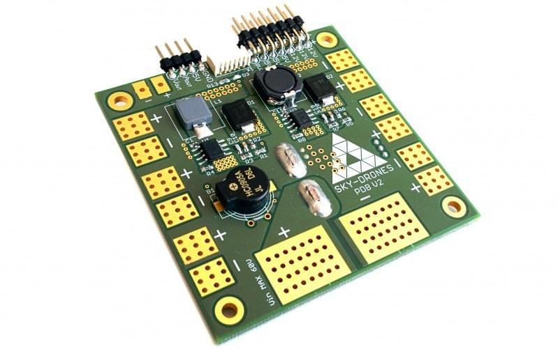
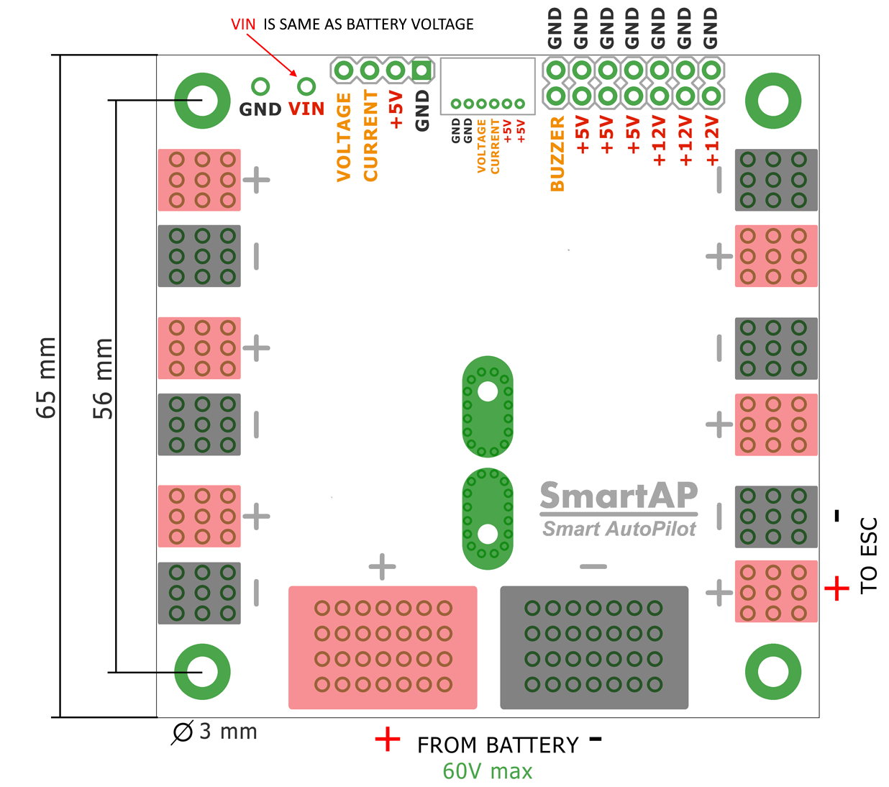
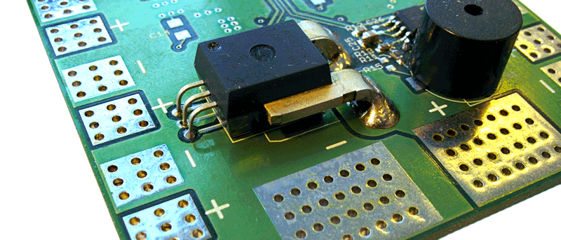

# Sky-Drones SmartAP PDB

[SmartAP PDB](https://sky-drones.com/power/smartap-pdb.html) (Power Distribution Board) is used to simplify the distribution of power from one or more batteries to ESCs (motors), flight controller, and other peripherals.
It also acts as a [power module](../power_module/index.md), enabling battery voltage and current measurements.
SmartAP PDB makes connecting high-power lines easier and much more reliable.

## 产品规格

- Size: 65x65 mm, 4x M3 mounting holes
- Input voltage up to 60 Volts (14S)
- Capability to handle extremenly high currents (peak current up to 400A)
- Power input from the main battery, possibility to connect up to 2 independent batteries
- 12 pairs of pads (6 on top, 6 on bottom) for powering up to 12 motors
- Integrated voltage and current sensors with L/C filters
- Precise Hall Effect based current measurements
- Integrated DC-DC converter from 10-60 V input (up to 14S battery) to 5V / 5A output to power peripherals
- Integrated DC-DC converter from 10-60 V input (up to 14S battery) to 12V / 5A output to power peripherals
- 5V and 12V power output terminals (standard 2.54mm/0.1" connectors)
- Integrated electromagnetic sounder (buzzer)
- Power output for the flight controller (both 5V regulated and battery voltage level output)

## Size and Weight

- Length: 65mm
- Width: 65mm
- Height: 14mm
- Weight: 16g

## PX4 配置

[Battery Estimation Tuning](../config/battery.md) describes how to configure the battery setting for a power module.

The key configuration settings are:

- Voltage divider: 15.51
- Amps per volt: 36.00

## Where to buy

[SmartAP PDB](https://sky-drones.com/parts/smartap-pdb.html)

## Wiring / Pinout

SmartAP Power Distribution Board pinout diagram is shown below.

The two big pads are intended for the main battery connection.
Up to two independent batteries can be connected using the thick wires (e.g. 8-10 AWG) to be able to handle high current loads and higher total capacity.
Up to 12 ESCs can be connected using the 6 smaller pads on top, bottom, left and right sides.

## Voltage and current sensors

SmartAP PDB has integrated voltage and current sensors.
The current sensor is located on the bottom side of the PDB.

## 更多信息

- [Buy SmartAP PDB](https://sky-drones.com/power/smartap-pdb.html)
- [Documentation](https://docs.sky-drones.com/avionics/smartap-pdb)
