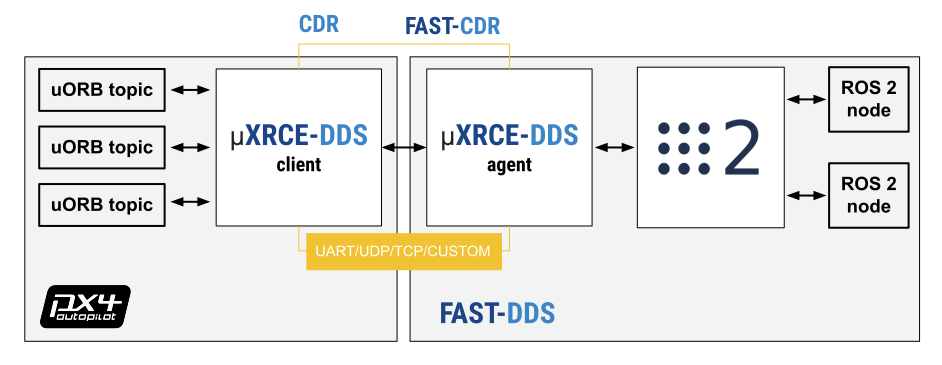
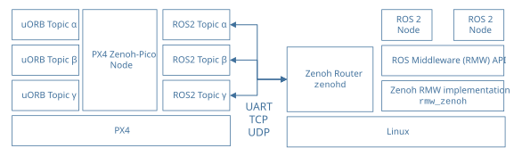
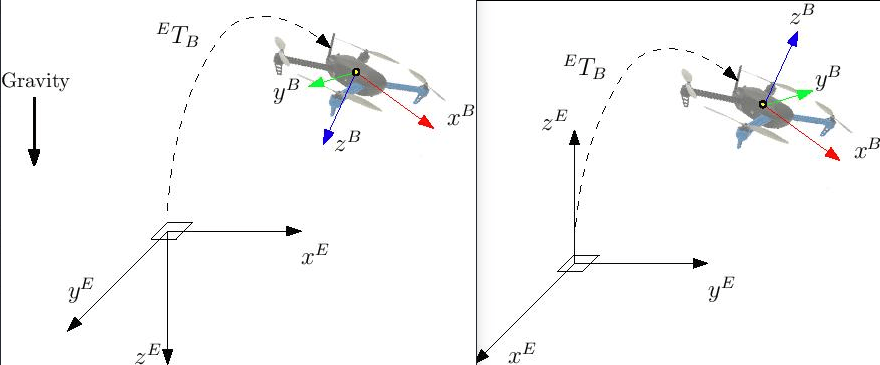

# ROS 2 用户指南

ROS 2-PX4 架构在ROS 2和PX4之间进行了深度整合。 允许 ROS 2 订阅或发布节点直接使用 PX4 uORB 话题。

本指南介绍了系统架构和应用程序流程，并解释了如何与PX4一起安装和使用ROS2。

## 综述

PX4 supports two middleware options for bridging uORB topics to ROS 2: [uXRCE-DDS](#dds) (DDS) and [Zenoh](#zenoh).
You must select which middleware to use and build your firmware accordingly (see [Installation & Setup](#installation-setup)).
DDS is currently recommended for most users, as it is more established and has been more thoroughly tested with PX4.

If you want to command the vehicle and create custom flight behaviours using ROS 2 (rather than just reading telemetry), you can create external modes using the [PX4 ROS 2 Interface Library](./px4_ros2_interface_lib.md), a ROS 2 native C++ library that works on top of either middleware.

:::info
The instructions below target simulation using Gazebo.
The same concepts translate directly to real hardware: the middleware client, which bridges the uORB topics, runs on the flight controller, while the agent/router runs on your companion computer.
See [Using Flight Controller Hardware](#using-flight-controller-hardware) for the hardware-specific differences.
:::

### DDS

<Badge type="tip" text="PX4 v1.14" />

The [uXRCE-DDS](../middleware/uxrce_dds.md) communications middleware is a large part of what makes the application pipeline for ROS 2 very straightforward.



<!-- doc source: https://docs.google.com/drawings/d/1WcJOU-EcVOZRPQwNzMEKJecShii2G4U3yhA3U6C4EhE/edit?usp=sharing -->

uXRCE-DDS 中间件由两部分组成：一部分是运行在 PX4 上的客户端，另一部分是运行在机载计算机上的代理；二者之间通过串口、UDP、TCP或自定义链路进行双向数据交换。
代理充当客户端的代理角色，以便在全局 DDS 数据空间中发布和订阅主题。

PX4 [uxrce_dds_client](../modules/modules_system.md#uxrce-dds-client) 是在构建时生成，并且默认包含在 PX4 固件中。
它包含“通用”XRCE-DDS客户端代码和它用来发布到来自uORB主题的 PX4 特定转换代码。
生成到客户端中的 uORB 消息子集在 [dds_topics.yaml](../middleware/dds_topics.md)中说明。
生成器使用源代码树中的 uORB 消息定义：[PX4-Autopilot/msg](https://github.com/PX4/PX4-Autopilot/tree/main/msg) 用于生成发送 ROS 2 消息的代码。

ROS 2 应用程序需要在一个工作空间中构建，该工作空间需包含与 PX4 固件中创建 uXRCE-DDS 客户端模块时所用完全相同的消息定义。
您可以通过克隆接口包[PX4/px4_msgs](https://github.com/PX4/px4_msgs)将这些内容纳入您的 ROS 2 工作空间(repo 中的范围与不同的 PX4 版本的消息相对应)。

Starting from PX4 v1.16, in which [message versioning](../middleware/uorb.md#message-versioning) was introduced, ROS 2 applications may use a different version of message definitions than those used to build PX4.
这需要[ROS 2 Message Translation Node](../ros2/px4_ros2_msg_translation_node.md)运行ROS 2 消息转换节点，以确保消息能够正确转换和交互。

需要注意的是，微型XRCE-DDS _agent_ 本身并不依赖客户端代码。
它可以从 [source](https://github.com/eProsima/Micro-XRCE-DDS-Agent) 中单独构建，或者作为ROS构建的一部分，或者作为snap包安装。

在使用 ROS 2 时，您通常需要同时启动客户端和代理。
需要注意的是，uXRCE-DDS 客户端默认已内置到固件中，但除仿真器构建版本外，不会自动启动。

See [uXRCE-DDS > Version selection](../middleware/uxrce_dds.md#version-selection) to check which Micro XRCE-DDS version to use for your ROS 2 distribution.

### Zenoh

<Badge type="tip" text="PX4 v1.17" /> <Badge type="warning" text="Experimental" />

PX4 supports [Zenoh](../middleware/zenoh.md) as an alternative middleware for bridging uORB topics to ROS 2, via the ROS 2 [`rmw_zenoh`](https://github.com/ros2/rmw_zenoh) middleware.
It provides a fast and lightweight way to connect PX4 to ROS 2.



The Zenoh-based middleware consists of a client running on PX4 (the [PX4 `zenoh` module](../modules/modules_driver.md#zenoh), based on Zenoh-Pico) and a Zenoh router (typically [zenohd](https://github.com/eclipse-zenoh/zenoh/tree/main/zenohd)) running on the companion computer, with bi-directional data exchange between them over a UART, TCP, UDP, or multicast-UDP link.
The router acts as a broker and discovery service, enabling PX4 to publish and subscribe to topics in the global Zenoh data space, and integrates seamlessly with ROS 2 nodes using `rmw_zenoh`.

See the [Zenoh](../middleware/zenoh.md) middleware page for full architecture and configuration details.

## 安装与设置

The supported and recommended ROS 2 platform for working with PX4 is ROS 2 "Jazzy" LTS on Ubuntu 24.04.

:::tip
If you're working on Ubuntu 22.04 you can use ROS 2 "Humble" LTS instead.
:::

安装使用 PX4 的 ROS 2：

- [Install PX4](#install-px4) (to use the PX4 simulator)
- [Install ROS 2](#install-ros-2)
- [Setup ROS 2 Workspace](#setup-ros-2-workspace)
- [Setup Middleware](#setup-middleware)
- [Running an example (optional)](#running-an-example-optional)

该架构中会自动安装的其他依赖项（如 Fast DDS）未在此处提及。

### 安装PX4

若要使用该仿真器，你需要安装 PX4 开发工具链。

:::info
唯一依赖于ROS2的 PX4 是一组信息定义，它从[px4_msgs](https://github.com/PX4/px4_msgs)获取。
您只需要安装 PX4 当您需要模拟器时(如我们在本指南中所做的那样)， 或者如果您正在创建一个发布自定义uORB主题的构建。
:::

通过以下方式在 Ubuntu 上配置一个 PX4 开发环境：

```sh
cd
git clone https://github.com/PX4/PX4-Autopilot.git --recursive
bash ./PX4-Autopilot/Tools/setup/ubuntu.sh
cd PX4-Autopilot/
make px4_sitl
```

请注意，上述命令将为您的Ubuntu版本安装推荐的模拟器。
如果您想要安装 PX4，但保留您现有的模拟器安装，请使用 "--no-sim-tools" 标志运行 `ubuntu.sh`。

欲了解更多信息和故障排除，请参阅：[Ubuntu 开发环境](../dev_setup/dev_env_linux_ubuntu.md) 和 [下载 PX4 源](../dev_setup/building_px4.md)。

### 安装 ROS 2

安装 ROS 2 及其依赖：

1. 安装 ROS 2.

   :::: tabs

   ::: tab jazzy
   To install ROS 2 "Jazzy" on Ubuntu 24.04:

   ```sh
   sudo apt update && sudo apt install locales
   sudo locale-gen en_US en_US.UTF-8
   sudo update-locale LC_ALL=en_US.UTF-8 LANG=en_US.UTF-8
   export LANG=en_US.UTF-8
   sudo apt install software-properties-common
   sudo add-apt-repository universe
   sudo apt update && sudo apt install curl -y
   export ROS_APT_SOURCE_VERSION=$(curl -s https://api.github.com/repos/ros-infrastructure/ros-apt-source/releases/latest | grep -F "tag_name" | awk -F'"' '{print $4}')
   curl -L -o /tmp/ros2-apt-source.deb "https://github.com/ros-infrastructure/ros-apt-source/releases/download/${ROS_APT_SOURCE_VERSION}/ros2-apt-source_${ROS_APT_SOURCE_VERSION}.$(. /etc/os-release && echo ${UBUNTU_CODENAME:-${VERSION_CODENAME}})_all.deb"
   sudo dpkg -i /tmp/ros2-apt-source.deb
   sudo apt update && sudo apt upgrade -y
   sudo apt install ros-jazzy-desktop
   sudo apt install ros-dev-tools
   source /opt/ros/jazzy/setup.bash && echo "source /opt/ros/jazzy/setup.bash" >> .bashrc
   ```

   The instructions above are reproduced from the official installation guide: [Install ROS 2 Jazzy](https://docs.ros.org/en/jazzy/Installation/Ubuntu-Install-Debs.html).
   You can install _either_ the desktop (`ros-jazzy-desktop`) _or_ bare-bones versions (`ros-jazzy-ros-base`), _and_ the development tools (`ros-dev-tools`).

:::

   ::: tab humble
   To install ROS 2 "Humble" on Ubuntu 22.04:

   ```sh
   sudo apt update && sudo apt install locales
   sudo locale-gen en_US en_US.UTF-8
   sudo update-locale LC_ALL=en_US.UTF-8 LANG=en_US.UTF-8
   export LANG=en_US.UTF-8
   sudo apt install software-properties-common
   sudo add-apt-repository universe
   sudo apt update && sudo apt install curl -y
   sudo curl -sSL https://raw.githubusercontent.com/ros/rosdistro/master/ros.key -o /usr/share/keyrings/ros-archive-keyring.gpg
   echo "deb [arch=$(dpkg --print-architecture) signed-by=/usr/share/keyrings/ros-archive-keyring.gpg] http://packages.ros.org/ros2/ubuntu $(. /etc/os-release && echo $UBUNTU_CODENAME) main" | sudo tee /etc/apt/sources.list.d/ros2.list > /dev/null
   sudo apt update && sudo apt upgrade -y
   sudo apt install ros-humble-desktop
   sudo apt install ros-dev-tools
   source /opt/ros/humble/setup.bash && echo "source /opt/ros/humble/setup.bash" >> .bashrc
   ```

   The instructions above are reproduced from the official installation guide: [Install ROS 2 Humble](https://docs.ros.org/en/humble/Installation/Ubuntu-Install-Debs.html).
   您可以安装 _either_ the desktop (`ros-humble-desktop`) _or_ bare-bones versions (`ros-humble-ros-base`), _and_ the development tools (`ros-dev-tools`).

:::

   ::::

2. 一些Python 依赖关系也必须安装 (使用 **`pip`** 或 **`apt`**):

   ```sh
   pip install --user -U empy==3.3.4 pyros-genmsg setuptools
   ```

### Setup ROS 2 workspace

A minimal ROS 2 workspace containing the [px4_msgs](https://github.com/PX4/px4_msgs) package is required to interpret the PX4 messages coming from the autopilot.

本节介绍如何在你的主目录中创建一个 ROS 2 工作空间（可根据需要修改命令，将源代码放置到其他位置）。

You should use a version of the `px4_msgs` package with the _same_ message definitions as the PX4 firmware you have installed in the step above.
Tags and branches in the `px4_msgs` repo are named to correspond to the message definitions for different PX4 releases and release branches.
If for any reason you cannot ensure the same message definitions between your PX4 firmware and ROS 2 `px4_msgs` package, you will additionally need to [start the message translation node](#optional-starting-the-translation-node) as part of your setup process.

要创建和构建工作空间：

1. 打开一个新的终端。

2. 使用以下方式创建并进入一个新的工作空间目录：

   ```sh
   mkdir -p ~/ros2_px4_ws/src/
   cd ~/ros2_px4_ws/src/
   ```

   ::: info
   一个为工作空间文件夹制定命名规范，有助于更轻松地管理工作空间。

:::

3. Clone [px4_msgs](https://github.com/PX4/px4_msgs) to the `/src` directory (the `main` branch is cloned by default, which corresponds to the version of PX4 we are running):

   ```sh
   git clone https://github.com/PX4/px4_msgs.git

   ```

4. 在当前终端中加载 ROS 2 开发环境，并使用 colcon 工具编译工作空间：

   :::: tabs

   ::: tab jazzy

   ```sh
   cd ~/ros2_px4_ws
   source /opt/ros/jazzy/setup.bash
   colcon build
   ```


:::

   ::: tab humble

   ```sh
   cd ~/ros2_px4_ws
   source /opt/ros/humble/setup.bash
   colcon build
   ```


:::

   ::::

   该操作会使用已加载的工具链对 /src 目录下的所有文件夹进行构建。
   You can now source the workspace with `source ~/ros2_px4_ws/install/setup.bash` to access the PX4 message definitions.
   For example, try `ros2 interface show px4_msgs/msg/SensorCombined`.

### Setup Middleware

This section explains how to set up either the [DDS](#dds_setup) or [Zenoh](#zenoh_setup) middleware.

:::tip
DDS is recommended for most users, as it is more established and has been more thoroughly tested with PX4.
:::

Make sure that your firmware has the corresponding module enabled: the [uxrce_dds_client](../modules/modules_system.md#uxrce-dds-client) module is included by default in most builds, while the [zenoh](../middleware/zenoh.md#px4-firmware) module must be explicitly enabled.
Please refer to the [using flight controller hardware](#using-flight-controller-hardware) setup section for more information about including the modules in you PX4 target.

#### DDS {#dds_setup}

要实现 ROS 2 与 PX4 的通信，[uXRCE-DDS client](../modules/modules_system.md#uxrce-dds-client)必须在 PX4 上运行，且需与运行在机载计算机上的微型 XRCE-DDS 代理建立连接。

##### 设置代理(Agent)

代理可以安装在机载计算机上 [number of ways](../middleware/uxrce_dds.md#micro-xrce-dds-agent-installation)。
Below we show how to build the agent inside the ROS 2 workspace `~/ros2_px4_ws` created above and connect to a client running on the PX4 simulator.

设置并启动代理：

1. 打开一个终端。

2. Enter the following commands to fetch the agent:

   :::: tabs

   ::: tab jazzy

   ```sh
   cd ~/ros2_px4_ws/src/
   git clone -b v2.4.3 https://github.com/eProsima/Micro-XRCE-DDS-Agent.git
   ```


:::

   ::: tab humble

   ```sh
   cd ~/ros2_px4_ws/src/
   git clone -b v2.4.2 https://github.com/eProsima/Micro-XRCE-DDS-Agent.git
   ```


:::

   ::::

3. Now re-build the ROS 2 workspace

   ```sh
   cd ~/ros2_px4_ws
   source install/setup.bash
   colcon build
   ```

4. 启动代理并设置以连接运行在模拟器上的 uXRCE-DDS客户端(Client)：

   ```sh
   source ~/ros2_px4_ws/install/setup.bash
   MicroXRCEAgent udp4 -p 8888
   ```

代理现已启动，但在我们启动 PX4（下一步） 之前，你不会看到太多。

:::info
你可以让代理在这个终端中保持运行状态！
需注意，每个连接通道仅允许运行一个代理
:::

##### Start the DDS Client

PX4 仿真器会自动启动 uXRCE-DDS 客户端，并连接到本地主机上的 UDP 8888 端口。

启动模拟器(和客户端)：

1. 在之前安装好的 PX4 自动驾驶仪 代码仓库的根目录下，打开一个新的终端。

   使用 PX4 [Gazebo](../sim_gazebo_gz/index.md) 模拟：

   ```sh
   make px4_sitl gz_x500
   ```

代理和客户端现已运行并二者应已建立连接。

PX4 终端会显示  [NuttShell/PX4 System Console](../debug/system_console.md) 系统控制台 的输出内容，该输出会在 PX4 启动和运行过程中实时呈现。
代理一建立连接，输出内容中就应包含 INFO 级别的消息，这些消息会显示数据撰写器的创建情况：

```sh
...
INFO  [uxrce_dds_client] synchronized with time offset 1675929429203524us
INFO  [uxrce_dds_client] successfully created rt/fmu/out/failsafe_flags data writer, topic id: 83
INFO  [uxrce_dds_client] successfully created rt/fmu/out/sensor_combined data writer, topic id: 168
INFO  [uxrce_dds_client] successfully created rt/fmu/out/timesync_status data writer, topic id: 188
```

微型 XRCE-DDS 代理终端也应开始显示输出内容，因为在 DDS 网络中会创建对应的主题：

```sh
...
[1675929445.268957] info     | ProxyClient.cpp    | create_publisher         | publisher created      | client_key: 0x00000001, publisher_id: 0x0DA(3), participant_id: 0x001(1)
[1675929445.269521] info     | ProxyClient.cpp    | create_datawriter        | datawriter created     | client_key: 0x00000001, datawriter_id: 0x0DA(5), publisher_id: 0x0DA(3)
[1675929445.270412] info     | ProxyClient.cpp    | create_topic             | topic created          | client_key: 0x00000001, topic_id: 0x0DF(2), participant_id: 0x001(1)
```

#### Zenoh {#zenoh_setup}

<Badge type="tip" text="PX4 v1.17" /> <Badge type="warning" text="Experimental" />

For ROS 2 to communicate with PX4 via Zenoh, the [PX4 Zenoh-Pico Node](../middleware/zenoh.md) must be running on PX4, connected to a Zenoh router (`zenohd`) running on the companion computer.

##### Setup the Router

Install and start the Zenoh router using ROS 2:

```sh
export RMW_IMPLEMENTATION=rmw_zenoh_cpp
ros2 run rmw_zenoh_cpp rmw_zenohd
```

For more information about the Zenoh Router see the [rmw_zenoh](https://github.com/ros2/rmw_zenoh?tab=readme-ov-file#start-the-zenoh-router) documentation.

:::info
You can leave the router running in this terminal!
:::

##### Start the Zenoh Client

启动模拟器(和客户端)：

1. 在之前安装好的 PX4 自动驾驶仪 代码仓库的根目录下，打开一个新的终端。

   Start a Zenoh-enabled PX4 [Gazebo](../sim_gazebo_gz/index.md) simulation using:

   ```sh
   make px4_sitl_zenoh gz_x500
   ```

2. In the PX4 shell, enable Zenoh and reboot to apply the change:

   ```sh
   param set ZENOH_ENABLE 1
   reboot
   ```

The default Zenoh daemon address for the `px4_sitl_zenoh` target is `localhost`, so no further network configuration is needed for simulation.
See [Zenoh > Configure Zenoh Network](../middleware/zenoh.md#configure-zenoh-network) if you need to connect to a router at a different address (such as on real hardware).

Once the client and router are connected, you can inspect the available topics using standard ROS 2 CLI tools, e.g. `ros2 topic list`, just make sure you ran `export RMW_IMPLEMENTATION=rmw_zenoh_cpp` in your terminal.

### Running an example (optional)

This optional section shows how to create a new ROS 2 workspace that:

- extends the one made in [Setup ROS 2 workspace](#setup-ros-2-workspace),
- clones the [px4_ros_com](https://github.com/PX4/px4_ros_com) package into it and
- launch the `sensor_combined_listener.launch.py` roslaunch file.

To create and build the new workspace:

1. 打开一个新的终端。

2. 使用以下方式创建并进入一个新的工作空间目录：

   ```sh
   mkdir -p ~/ws_sensor_combined/src/
   cd ~/ws_sensor_combined/src/

   ```

3. Clone the example repository to the `src` directory:

   ```sh
   git clone https://github.com/PX4/px4_ros_com.git
   ```

4. Source the previously built ROS 2 PX4 development environment into the current terminal and compile the workspace using `colcon`:

   ```sh
   cd ..
   source ~/ros2_px4_ws/install/setup.bash
   colcon build
   ```

:::info
The [ROS 2 beginner tutorials](https://docs.ros.org/en/humble/Tutorials/Beginner-Client-Libraries/Creating-A-Workspace/Creating-A-Workspace.html#source-the-overlay) recommend that you _open a new terminal_ for running your executables.
:::

在新终端中：

1. Navigate into the top level of your workspace directory and source the ROS 2 environment:

   ```sh
   cd ~/ws_sensor_combined/
   source ~/ws_sensor_combined/install/setup.bash
   ```

2. If using `zenoh` change the ROS 2 middleware to zenoh:

   ```sh
   export RMW_IMPLEMENTATION=rmw_zenoh_cpp
   ```

3. 现在启动示例。
   请注意，此处我们使用的是 ros2 launch，其相关说明如下。

   ```sh
   ros2 launch px4_ros_com sensor_combined_listener.launch.py
   ```

若此功能正常运行，你应能在启动 ROS 监听器的终端 / 控制台上看到数据正在打印输出

```sh
RECEIVED DATA FROM SENSOR COMBINED
================================
ts: 870938190
gyro_rad[0]: 0.00341645
gyro_rad[1]: 0.00626475
gyro_rad[2]: -0.000515705
gyro_integral_dt: 4739
accelerometer_timestamp_relative: 0
accelerometer_m_s2[0]: -0.273381
accelerometer_m_s2[1]: 0.0949186
accelerometer_m_s2[2]: -9.76044
accelerometer_integral_dt: 4739
```

#### (可选) 启动转化节点

<Badge type="tip" text="PX4 v1.16" /> <Badge type="warning" text="Experimental" />

This example is built with PX4 and ROS 2 versions that use the same message definitions.
若你要使用不兼容的 [message versions](../middleware/uorb.md#message-versioning)，则在运行示例之前，还需要安装并运行[Message Translation Node](./px4_ros2_msg_translation_node.md)：

1. 通过运行以下脚本，将 [Message Translation Node](../ros2/px4_ros2_msg_translation_node.md) 纳入示例工作空间或单独的工作空间中

   ```sh
   cd /path/to/ros_ws
   /path/to/PX4-Autopilot/Tools/copy_to_ros_ws.sh .
   ```

2. 构建并运行转化节点：

   ```sh
   colcon build
   source install/local_setup.bash
   ros2 run translation_node translation_node_bin
   ```

## 控制机体

要控制应用，ROS 2 应用程序：

- 订阅 (聆听) PX4 发布的数传主题
- 发布到导致PX4执行某些操作的主题。

您可以使用的主题定义在[dds_topics.yaml](../middleware/dds_topics.md)， 并且您可以在  [uORB Message Reference](../msg_docs/index.md)获取更多关于他们数据的信息。
例如，[VehicleGlobalPosition](../msg_docs/VehicleGlobalPosition.md) 可以用来获得机体的全局位置。 [VehicleCommand](../msg_docs/VehicleCommand.md) 可以用于命令诸如起飞和降落等操作。

下面的 [ROS 2 Example applications](#ros-2-example-applications)  示例提供了如何使用这些主题的具体例子。

## 兼容性问题

本节包含的信息可能会影响你编写 ROS 代码的方式。

### ROS 2 订阅者QoS 设置

用于订阅 PX4 发布的话题的 ROS 2 代码，必须指定合适（兼容）的 QoS（服务质量）设置，才能监听这些话题。
具体而言，节点应使用 ROS 2 预定义的 QoS 传感器数据（可参考[listener example source code](#ros-2-listener)）进行订阅：

```cpp
...
rmw_qos_profile_t qos_profile = rmw_qos_profile_sensor_data;
auto qos = rclcpp::QoS(rclcpp::QoSInitialization(qos_profile.history, 5), qos_profile);

subscription_ = this->create_subscription<0>("/fmu/out/sensor_combined", qos,
...
```

需要这样做的原因是，ROS 2 的默认 [Quality of Service (QoS) settings](https://docs.ros.org/en/humble/Concepts/About-Quality-of-Service-Settings.html#qos-profiles)与 PX4 所使用的设置不同。
并非所有发布者 - 订阅者的 [Qos settings are possible](https://docs.ros.org/en/humble/Concepts/About-Quality-of-Service-Settings.html#qos-compatibilities)，而事实证明，ROS 2 默认的订阅者设置就属于不可行的情况！需注意，ROS 代码在发布时无需设置 QoS参数（在此场景下，PX4 的 QoS 设置与 ROS 的默认 QoS 设置是兼容的）。

<!-- From https://github.com/PX4/PX4-user_guide/pull/2259#discussion_r1099788316 -->

### ROS 2 & PX4 坐标系公约

ROS与 PX4所使用的本地 / 世界坐标系和机体坐标系存在差异。

| 框架    | PX4                                                                 | ROS                                                              |
| ----- | ------------------------------------------------------------------- | ---------------------------------------------------------------- |
| 机体    | FRD (X **F**orward, Y **R**ight, Z **D**own)     | FLU (X **F**orward, Y **L**eft, Z **U**p)     |
| 世界坐标系 | FRD or NED (X **N**orth, Y **E**ast, Z **D**own) | FLU 或 ENU (X **E**ast, Y **N**orth, Z **U**p) |

:::tip
See [REP105: Coordinate Frames for Mobile Platforms](https://www.ros.org/reps/rep-0105.html) for more information about ROS frames.
:::

如果你把机体命名为 <code>robot1</code>，你会得到一个主题，比如 <code>/vrpn_client_node/robot1/pose</code>



除非在相关消息定义中明确指定，否则所有PX4 话题均采用 FRD（即 NED）坐标系约定。
因此，想要与 PX4 进行交互的 ROS 2 节点，必须妥善处理坐标系约定问题。

- 要将一个向量从ENU坐标系旋转到NED坐标系，必须执行两个基本旋转操作：
  - 首先是绕 Z 轴（朝上方向）旋转 π/2 弧度。
  - 然后是绕 X 轴（原东向 / 新北向）旋转 π 弧度

- 要将一个向量从NED坐标系旋转到ENU坐标系，必须执行两个基本旋转操作：

- - 首先是绕 Z 轴（朝下方向）旋转 π/2 弧度。
  - 然后是绕 X 轴（原北向 / 新东向）旋转 π 弧度。 需注意，这两种最终得到的操作在数学上是等效的

- 将向量从 FLU坐标系旋转到 FRD坐标系，仅需绕 X 轴（朝前方向）旋转 π 弧度即可。

- 将向量从 FRD坐标系旋转到 FLU坐标系，仅需绕 X 轴（朝前方向）旋转 π 弧度即可。

需要进行旋转处理的向量示例包括：

- [TrajectorySetpoint](../msg_docs/TrajectorySetpoint.md)消息中的所有字段；发送这些字段前，需先将其从 ENU坐标系转换为 NED坐标系。
- [VehicleThrustSetpoint](../msg_docs/VehicleThrustSetpoint.md)消息中的所有字段；发送这些字段前，需先将其从 FLU坐标系转换为 FRD坐标系。

与向量类似，用于表示飞行器（机体坐标系）相对于（w.r.t.）姿态的四元数也是如此。 （相对于）世界坐标系（的四元数）需要进行转换。

[PX4/px4_ros_com](https://github.com/PX4/px4_ros_com) 提供了名为  [frame_transforms](https://github.com/PX4/px4_ros_com/blob/main/include/px4_ros_com/frame_transforms.h)的共享库，可便捷地执行此类转换操作。

### ROS, Gazebo 和 PX4 时间同步

默认情况下，ROS 2 与 PX4 之间的时间同步由[uXRCE-DDS middleware](https://micro-xrce-dds.docs.eprosima.com/en/latest/time_sync.html) 自动管理；若需查看时间同步统计信息，可监听已桥接的话题 /fmu/out/timesync_status。
当 uXRCE-DDS 客户端运行在飞控器上，且代理运行在机载计算机上时，这便是理想的运行状态 —— 此时时间偏移、时间漂移以及通信延迟会被自动计算并补偿。

在 Gazebo 仿真中，GZBridge 会在每个仿真步长（sim step）为 PX4 设置时间[Change simulation speed](../sim_gazebo_gz/index.md#change-simulation-speed)。
需注意，这与 Gazebo Classic所采用的仿真锁步[simulation lockstep](../sim_gazebo_classic/index.md#lockstep)流程不同。

ROS 2 users have then two possibilities regarding the [time source](https://design.ros2.org/articles/clock_and_time.html) of their nodes.

#### ROS 2 nodes use the OS clock as time source

This scenario, which is the one considered in this page and in the [offboard_control](./offboard_control.md) guide, is also the standard behaviour of the ROS 2 nodes.
操作系统时钟作为时间来源，因此它只能在模拟实时系数非常接近时才能使用。
The time synchronizer of the uXRCE-DDS client then bridges the OS clock on the ROS 2 side with the Gazebo clock on the PX4 side.
用户不需要进一步操作。

#### ROS 2 nodes use the Gazebo clock as time source

In this scenario, ROS 2 also uses the Gazebo `/clock` topic as time source.
This approach makes sense if the Gazebo simulation is running with real time factor different from one, or if ROS 2 needs to directly interact with Gazebo.
On the ROS 2 side, direct interaction with Gazebo is achieved by the [ros_gz_bridge](https://github.com/gazebosim/ros_gz) package of the [ros_gz](https://github.com/gazebosim/ros_gz) repository.

Use the following commands to install the correct ROS 2/gz interface packages (not just the bridge) for the ROS 2 and Gazebo version(s) supported by PX4.

:::: tabs

:::tab jazzy
To install the bridge for use with ROS 2 "Jazzy" and Gazebo Harmonic (on Ubuntu 24.04):

```sh
sudo apt install ros-jazzy-ros-gzharmonic
```

:::

:::tab humble
在 Ubuntu 22.04 系统上，若需安装用于搭配 ROS 2 “Humble”与 Gazebo Harmonic的桥接功能包，可执行以下操作：

```sh
sudo apt install ros-humble-ros-gzharmonic
```

:::

::::

:::info
The [repo](https://github.com/gazebosim/ros_gz#readme) and [package](https://github.com/gazebosim/ros_gz/tree/ros2/ros_gz_bridge#readme) READMEs show the package versions that need to be installed depending on your ROS 2 and Gazebo versions.
:::

功能包安装并完成环境配置后，parameter_bridge节点会提供桥接能力，可用于创建一个单向的/clock桥接。

```sh
ros2 run ros_gz_bridge parameter_bridge /clock@rosgraph_msgs/msg/Clock[gz.msgs.Clock
```

At this point, every ROS 2 node must be instructed to use the newly bridged `/clock` topic as time source instead of the OS one, this is done by setting the parameter `use_sim_time` (of _each_ node) to `true` (see [ROS clock and Time design](https://design.ros2.org/articles/clock_and_time.html)).

This concludes the modifications required on the ROS 2 side. 在 PX4 端，你只需停止 uXRCE-DDS 时间同步功能，将参数[UXRCE_DDS_SYNCT](../advanced_config/parameter_reference.md#UXRCE_DDS_SYNCT)设置为false即可。
By doing so, Gazebo will act as main and only time source for both ROS 2 and PX4.

## ROS 2 示例应用程序

### ROS 2 Listener

[px4_ros_com](https://github.com/PX4/px4_ros_com中的 ROS 2  [listener examples](https://github.com/PX4/px4_ros_com/tree/main/src/examples/listeners)  repo展示了如何编写 ROS 节点，以监听由 PX4 发布的话题

此处我们以 px4_ros_com/src/examples/listeners 路径下的 [sensor_combined_listener.cpp](https://github.com/PX4/px4_ros_com/blob/main/src/examples/listeners/sensor_combined_listener.cpp) 节点为例，该节点会订阅 [SensorCombined](../msg_docs/SensorCombined.md) 消息。

:::info
[Running an example (optional)](#running-an-example-optional) shows how to build and run this example.
:::

代码首先导入了与 ROS 2 中间件进行交互所需的 C++ 库，以及该节点所订阅的SensorCombined消息对应的头部文件：

```cpp
#include <rclcpp/rclcpp.hpp>
#include <px4_msgs/msg/sensor_combined.hpp>
```

随后，代码创建了一个 SensorCombinedListener 类，该类继承自通用的 rclcpp::Node 基类。

```cpp
/**
 * @brief Sensor Combined uORB topic data callback
 */
class SensorCombinedListener : public rclcpp::Node
{
```

这会创建一个回调函数，用于处理SensorCombined uORB 消息（当前以微型 XRCE-DDS 消息格式传输）的接收事件；每当接收到该消息时，该函数会输出消息字段的内容

```cpp
public:
  explicit SensorCombinedListener() : Node("sensor_combined_listener")
  {
    rmw_qos_profile_t qos_profile = rmw_qos_profile_sensor_data;
    auto qos = rclcpp::QoS(rclcpp::QoSInitialization(qos_profile.history, 5), qos_profile);

    subscription_ = this->create_subscription<px4_msgs::msg::SensorCombined>("/fmu/out/sensor_combined", qos,
    [this](const px4_msgs::msg::SensorCombined::UniquePtr msg) {
      std::cout << "\n\n\n\n\n\n\n\n\n\n\n\n\n\n\n\n\n\n\n\n\n\n\n\n";
      std::cout << "RECEIVED SENSOR COMBINED DATA"   << std::endl;
      std::cout << "============================="   << std::endl;
      std::cout << "ts: "          << msg->timestamp    << std::endl;
      std::cout << "gyro_rad[0]: " << msg->gyro_rad[0]  << std::endl;
      std::cout << "gyro_rad[1]: " << msg->gyro_rad[1]  << std::endl;
      std::cout << "gyro_rad[2]: " << msg->gyro_rad[2]  << std::endl;
      std::cout << "gyro_integral_dt: " << msg->gyro_integral_dt << std::endl;
      std::cout << "accelerometer_timestamp_relative: " << msg->accelerometer_timestamp_relative << std::endl;
      std::cout << "accelerometer_m_s2[0]: " << msg->accelerometer_m_s2[0] << std::endl;
      std::cout << "accelerometer_m_s2[1]: " << msg->accelerometer_m_s2[1] << std::endl;
      std::cout << "accelerometer_m_s2[2]: " << msg->accelerometer_m_s2[2] << std::endl;
      std::cout << "accelerometer_integral_dt: " << msg->accelerometer_integral_dt << std::endl;
    });
  }
```

:::info
该订阅会基于 rmw_qos_profile_sensor_data 设置一个 QoS 配置文件。
之所以需要这样做，是因为 ROS 2 订阅者的默认 QoS（服务质量）配置文件，与 PX4 发布者的配置文件不兼容。
欲了解更多信息，请参阅：[ROS 2 Subscriber QoS Settings](#ros-2-subscriber-qos-settings),
:::

以下代码行创建了一个发布者，用于向 SensorCombined uORB 话题发布数据；该发布者可与一个或多个兼容的 ROS 2 订阅者匹配，这些订阅者监听的是 fmu/sensor_combined/out ROS 2 话题。

```cpp
private:
 rclcpp::Subscription<px4_msgs::msg::SensorCombined>::SharedPtr subscription_;
};
```

The instantiation of the `SensorCombinedListener` class as a ROS node is done on the `main` function.

```cpp
int main(int argc, char *argv[])
{
  std::cout << "Starting sensor_combined listener node..." << std::endl;
  setvbuf(stdout, NULL, _IONBF, BUFSIZ);
  rclcpp::init(argc, argv);
  rclcpp::spin(std::make_shared<SensorCombinedListener>());

  rclcpp::shutdown();
  return 0;
}
```

此特殊示例在[launch/sensor_combined_listener.launch.py](https://github.com/PX4/px4_ros_com/blob/main/launch/sensor_combined_listener.launch.py).有一个相关的启动文件。
这使得它可以通过 [`ros2 launch`](#ros2-launch)  命令启动

### ROS 2 发布者

一个 ROS 2 发布者节点会将数据发布到 DDS/RTPS 网络中（进而传递给 PX4 自动驾驶仪）。

以 px4_ros_com/src/advertisers 路径下的 debug_vect_advertiser.cpp（文件）为例，首先我们会导入所需的headers，其中包括 `debug_vect` msg header。

```cpp
#include <chrono>
#include <rclcpp/rclcpp.hpp>
#include <px4_msgs/msg/debug_vect.hpp>

using namespace std::chrono_literals;
```

随后，代码创建了一个 DebugVectAdvertiser 类，该类继承自通用的 rclcpp::Node 基类。

```cpp
class DebugVectAdvertiser : public rclcpp::Node
{
```

这段代码创建了一个用来发送消息的回调函数。
发送消息的回调函数由定时器触发的，每秒钟发送两次消息。

```cpp
public:
  DebugVectAdvertiser() : Node("debug_vect_advertiser") {
    publisher_ = this->create_publisher<px4_msgs::msg::DebugVect>("fmu/debug_vect/in", 10);
    auto timer_callback =
    [this]()->void {
      auto debug_vect = px4_msgs::msg::DebugVect();
      debug_vect.timestamp = std::chrono::time_point_cast<std::chrono::microseconds>(std::chrono::steady_clock::now()).time_since_epoch().count();
      std::string name = "test";
      std::copy(name.begin(), name.end(), debug_vect.name.begin());
      debug_vect.x = 1.0;
      debug_vect.y = 2.0;
      debug_vect.z = 3.0;
      RCLCPP_INFO(this->get_logger(), "\033[97m Publishing debug_vect: time: %llu x: %f y: %f z: %f \033[0m",
                                    debug_vect.timestamp, debug_vect.x, debug_vect.y, debug_vect.z);
      this->publisher_->publish(debug_vect);
    };
    timer_ = this->create_wall_timer(500ms, timer_callback);
  }

private:
  rclcpp::TimerBase::SharedPtr timer_;
  rclcpp::Publisher<px4_msgs::msg::DebugVect>::SharedPtr publisher_;
};
```

这段代码在 main 函数中将 DebugVectAdvertiser 类实例化成一个ROS节点。

```cpp
int main(int argc, char *argv[])
{
  std::cout << "Starting debug_vect advertiser node..." << std::endl;
  setvbuf(stdout, NULL, _IONBF, BUFSIZ);
  rclcpp::init(argc, argv);
  rclcpp::spin(std::make_shared<DebugVectAdvertiser>());

  rclcpp::shutdown();
  return 0;
}
```

### Offboard控制

[ROS 2 Offboard control example](../ros2/offboard_control.md) provides a complete C++ reference example of how to use [offboard control](../flight_modes/offboard.md) of PX4 with ROS 2.

[Python ROS 2 offboard examples with PX4](https://github.com/Jaeyoung-Lim/px4-offboard) (Jaeyoung-Lim/px4-offboard) provides a similar example for Python, and includes the scripts:

- `offboard_control.py`: 使用位置设定值进行离板位置控制的示例
- “visualizer.py\`：用于可视化载体状态的 Rviz

## 使用飞行控制器硬件

在飞行控制器上运行的 PX4 号ROS2与在模拟器上运行的 PX4 几乎相同。
The differences are:

- You need to ensure your PX4 firmware contains the client module.
- You need to start both the agent _and the client_, with settings appropriate for the communication channel.

:::: tabs

:::tab uXRCE-DDS Client
The key `CONFIG_MODULES_UXRCE_DDS_CLIENT=y` must be in your board's `default.px4board` [KConfig file](../hardware/porting_guide_config.md).

See uXRCE-DDS client [firmware setup](../middleware/uxrce_dds.md#px4-firmware) for complete information.

Client configuration is instead handled through PX4 parameters, see [Starting uXRCE-DDS](../middleware/uxrce_dds.md#starting-agent-and-client).
:::

:::tab Zenoh Client
The key `CONFIG_MODULES_ZENOH=y` must be in your board's `default.px4board` [KConfig file](../hardware/porting_guide_config.md).

After that it can be enabled on PX4 startup by setting the [ZENOH_ENABLE](../advanced_config/parameter_reference.md#ZENOH_ENABLE) parameter to `1`.

Node configuration (network, pubishers options, topic mapping) is instead handled by configuration files (`zenoh/net.txt`, `zenoh/pub.csv`, `zenoh/sub.csv`) stored in the flight controller SD card and it can be modified at runtime using the `zenoh config` CLI tool.

See Zenoh client [node setup](../middleware/zenoh.md#px4-zenoh-pico-node-setup) for complete information.
:::

::::

## 自定义 uORB 主题

ROS 2需要有用于在 PX4 固件中创建 uXRCE-DDS客户端模块的 _sam_message 定义，以便解释消息。
这些定义存储在 ROS 2 接口包[PX4/px4_msgs](https://github.com/PX4/px4_msgs)中，并且会通过CI在 main（主）分支和发布分支上自动同步。
需要注意的是，PX4 源代码中的所有消息均存在于该代码仓库中，但只有在dds_topics.yaml文件中列出的消息，才会作为 ROS 2 话题可用。
因此

- 如果您正在使用 PX4 的主要版本或发布版本，您可以通过克隆接口包[PX4/px4_msgs](https://github.com/PX4/px4_msgs)获得消息定义。
- 如果您要创建或修改 uORB 消息，必须从 PX4 源代码树中手动更新工作空间中的消息。
  一般来说，这意味着您将更新 [dds_topics.yaml](https://github.com/PX4/PX4-Autopilot/blob/main/src/modules/uxrce_dds_client/dds_topics.yaml)，克隆接口包。 然后手动同步，将新的/修改的消息定义从 [PX4-Autopilot/msg](https://github.com/PX4/PX4-Autopilot/tree/main/msg)复制到它的 `msg` 文件夹。
  假定PX4-Autopilot在你的主目录`~`中，而`px4_msgs`则在`~/ros2_ws/src/`中，命令可能是：

  ```sh
  rm ~/ros2_ws/src/px4_msgs/msg/*.msg
  cp ~/PX4-Autopilot/msg/*.msg ~/ros2_ws/src/px4_msgs/msg/
  ```

  ::: info
  从技术角度而言，[dds_topics.yaml](https://github.com/PX4/PX4-Autopilot/blob/main/src/modules/uxrce_dds_client/dds_topics.yaml) 这个文件完整定义了 PX4 uORB 话题与 ROS 2 消息之间的对应关系。
  欲了解更多信息，请参阅[uXRCE-DDS > DDS Topics YAML](../middleware/uxrce_dds.md#dds-topics-yaml)。

:::

## Customizing the Namespace

自定义主题和服务命名空间可以在构建时间(更改 [dds_topics.yaml](https://github.com/PX4/PX4-Autopilot/blob/main/src/modules/uxrce_dds_client/dds_topics.yaml))或运行时间(对多载体操作有用)：

- 一种可能性是在从命令行启动[uxrce_dds_client](../modules/modules_system.md#uxrce-dds-client)时使用 "-n" 选项。
  这种技术既可用于模拟，也可用于实际机体。
- 在开始模拟前，可以通过设置环境变量 `PX4_UXRCE_DDS_NS`来提供自定义命名空间 (仅限)

:::info
更改运行时的命名空间将会将所需的命名空间作为一个前缀附加到 [dds_topics.yaml](../middleware/dds_topics.md) 中所有的 "topic " 字段和所有 [service servers](#px4-ros-2-service-servers)。
因此，命令如下：

```sh
uxrce_dds_client start -n uav_1
```

或

```sh
PX4_UXRCE_DDS_NS=uav_1 make px4_sitl gz_x500
```

将在以下命名空间下生成话题：

```sh
/uav_1/fmu/in/  # for subscribers
/uav_1/fmu/out/ # for publishers
```

:::

## PX4 ROS 2 Service Servers

<Badge type="tip" text="PX4 v1.15" />

PX4 uXRCE-DDS middleware supports [ROS 2 services](https://docs.ros.org/en/jazzy/Concepts/Basic/About-Services.html).
服务（Services）是一种远程过程调用（remote procedure calls），由一个节点发起，向另一个节点请求调用，最终会返回一个结果。

A service server is the entity that will accept a remote procedure request, perform some computation on it, and return the result.
They simplify communication between ROS 2 nodes and PX4 by grouping the request and response behaviour, and ensuring that replies are only returned to the specific requesting user.
这比发布请求、订阅回复并过滤掉所有不需要的响应要容易得多。

构建在 PX4 [uxrce_dds_client](../modules/modules_system.md#uxrce-dds-client) 模块中的服务服务器包括：

- `/fmu/vehicle_command` (definition: [`px4_msgs::srv::VehicleCommand`](https://github.com/PX4/px4_msgs/blob/main/srv/VehicleCommand.srv).)

  此服务可以被 ROS 2 应用程序调用来发送 PX4[VehicleCommand](../msg_docs/VehicleCommand.md) uORB 消息，并相应接收 PX4  [VehicleCommandAck](../msg_docs/VehicleCommandAck.md)uORB 消息。

所有 PX4 服务名称均遵循 `{extra_namespace}/fmu/{server_specific_name}` 这一约定，其中 {extra_namespace} 与可分配给 PX4 话题的 [custom namespace](#customizing-the-namespace)相同。

具体细节和示例将在以下章节中提供。

### 载体指挥服务

这可用于向飞行器发送指令（例如 “起飞”“着陆”“切换模式” 和 “盘旋”），并接收响应。

服务类型在 [`px4_msgs::srv::VehicleCommand`](https://github.com/PX4/px4_msgs/blob/main/srv/VehicleCommand.srv)  中定义如下：

```txt
VehicleCommand request
---
VehicleCommandAck reply
```

用户可通过发送  [VehicleCommand](../msg_docs/VehicleCommand.md)消息发起服务请求，并会收到一条[VehicleCommandAck](../msg_docs/VehicleCommandAck.md) 消息作为响应。
该服务可确保仅将针对用户发起的特定请求所生成的 VehicleCommandAck回复返回。

#### 载体指挥服务离板控制示例

在 px4_ros_com 功能包中，有一个[offboard_control_srv](https://github.com/PX4/px4_ros_com/blob/main/src/examples/offboard/offboard_control_srv.cpp) 节点，该节点提供了一个完整的、使用 VehicleCommand 服务实现离板控制的示例。

该示例与[ROS 2 Offboard Control Example](../ros2/offboard_control.md) 中描述的离板控制示例高度相似，但使用 VehicleCommand 服务来请求模式切换、飞行器上锁和飞行器解锁。

First the ROS 2 application declares a service client of type `px4_msgs::srv::VehicleCommand` using `rclcpp::Client()` as shown (this is the same approach used for all ROS 2 service clients):

```cpp
rclcpp::Client<0>::SharedPtr vehicle_command_client_;
```

然后客户端初始化到正确的 ROS 2 服务 (`/fmu/vehicle_command` )。
当应用程序假设使用标准的 PX4 命名空间时，这样做的代码看起来就像这样：

```cpp
vehicle_command_client_{this->create_client<px4_msgs::srv::VehicleCommand>("/fmu/vehicle_command")}
```

此后，客户可以用来发送任何机体命令请求。
例如，`arm()`函数用于请求机体放置：

```cpp
void OffboardControl::arm()
{
  RCLCPP_INFO(this->get_logger(), "requesting arm");
  request_vehicle_command(VehicleCommand::VEHICLE_CMD_COMPONENT_ARM_DISARM, 1.0);
}
```

`request_vehicle_command`处理请求格式化并在_asynchronous_ [mode](https://docs.ros.org/en/humble/How-To-Guides/Sync-Vs-Async.html#asynchronous-calls):

```cpp
void OffboardControl::request_vehicle_command(uint16_t command, float param1, float param2)
{
  auto request = std::make_shared<px4_msgs::srv::VehicleCommand>();

  VehicleCommand msg{};
  msg.param1 = param1;
  msg.param2 = param2;
  msg.command = command;
  msg.target_system = 1;
  msg.target_component = 1;
  msg.source_system = 1;
  msg.source_component = 1;
  msg.from_external = true;
  msg.timestamp = this->get_clock()->now().nanoseconds() / 1000;
  request->request = msg;

  service_done_ = false;
  auto result = vehicle_command_client_->async_send_request(request, std::bind(&OffboardControl::response_callback, this,
                           std::placeholders::_1));
  RCLCPP_INFO(this->get_logger(), "Command send");
}
```

最终，响应由 response_callback 方法以异步方式捕获，该方法会检查请求结果：

```cpp
void OffboardControl::response_callback(
      rclcpp::Client<0>::SharedFuture future) {
    auto status = future.wait_for(1s);
    if (status == std::future_status::ready) {
      auto reply = future.get()->reply;
      service_result_ = reply.result;
      // make decision based on service_result_
      service_done_ = true;
    } else {
      RCLCPP_INFO(this->get_logger(), "Service In-Progress...");
    }
  }
```

## ros2 CLI

[ros2 CLI](https://docs.ros.org/en/humble/Tutorials/Beginner-CLI-Tools.html)是一个有用的工具来处理ROS。
例如，您可以使用它快速检查话题是否正在发布；如果您的工作空间中包含 px4_msg，还可以详细查看这些话题的内容。
该命令还允许您通过启动文件（launch file）启动更复杂的 ROS 系统。
下文显示了几种可能性。

### ros2 topic list

使用 ros2 topic list 命令列出 ROS 2 可识别的话题：

```sh
ros2 topic list
```

若 PX4 已连接至代理，输出结果将是一份话题类型列表：

```sh
/fmu/in/obstacle_distance
/fmu/in/offboard_control_mode
/fmu/in/onboard_computer_status
...
```

请注意，工作区不需要使用 px4_msgs 构建才能成功；主题类型信息是消息有效载荷的一部分。

### ros2 topic echo

使用  `ros2 topic echo`"来显示特定主题的详细信息。

与 ros2 topic list 命令不同，要让该功能正常工作，你必须处于一个已编译 px4_msgs且已执行 local_setup.bash 脚本的工作空间中，这样 ROS 才能解析相关消息

```sh
ros2 topic echo /fmu/out/vehicle_status
```

该命令将在主题细节更新时响应它们的详细信息。

```sh
---
timestamp: 1675931593364359
armed_time: 0
takeoff_time: 0
arming_state: 1
latest_arming_reason: 0
latest_disarming_reason: 0
nav_state_timestamp: 3296000
nav_state_user_intention: 4
nav_state: 4
failure_detector_status: 0
hil_state: 0
...
---
```

### ros2 topic hz

你可以使用 ros2 topic hz 命令获取消息速率相关的统计信息。
例如，获取`SensorCombined`速率：

```sh
ros2 topic hz /fmu/out/sensor_combined
```

输出会看起来像这样：

```sh
average rate: 248.187
min: 0.000s max: 0.012s std dev: 0.00147s window: 2724
average rate: 248.006
min: 0.000s max: 0.012s std dev: 0.00147s window: 2972
average rate: 247.330
min: 0.000s max: 0.012s std dev: 0.00148s window: 3212
average rate: 247.497
min: 0.000s max: 0.012s std dev: 0.00149s window: 3464
average rate: 247.458
min: 0.000s max: 0.012s std dev: 0.00149s window: 3712
average rate: 247.485
min: 0.000s max: 0.012s std dev: 0.00148s window: 3960
```

### ros2 launch

ros2 launch 命令用于启动一个 ROS 2 启动文件
例如，前面我们使用 ros2 launch px4_ros_com sensor_combined_listener.launch.py 命令启动了监听器示例。

你并非必须使用启动文件，但如果你的 ROS 2 系统较为复杂，需要启动多个组件，那么启动文件会非常实用。

关于启动文件的信息，请参阅 [ROS 2 Tutorials > Creating launch files](https://docs.ros.org/en/humble/Tutorials/Intermediate/Launch/Creating-Launch-Files.html)

## 故障处理

### 缺少依赖项

标准安装应包含 ROS 2 所需的所有工具。

如果有任何缺失，可以单独添加：

- **`colcon`** 构建工具应该在开发工具中。
  可以使用以下方式安装它：

  ```sh
  sudo apt install python3-colcon-common-extensions
  ```

- 变换库（transforms library）所使用的 Eigen3 库，应同时存在于桌面版（desktop）功能包和基础版（base）功能包中。
  它应该安装在显示中：

  :::: tabs

  ::: tab jazzy

  ```sh
  sudo apt install ros-jazzy-eigen3-cmake-module
  ```


:::

  ::: tab humble

  ```sh
  sudo apt install ros-humble-eigen3-cmake-module
  ```


:::

  ::::

### ros_gz_bridge not publishing on the \clock topic

If your [ROS 2 nodes use the Gazebo clock as time source](../ros2/user_guide.md#ros-2-nodes-use-the-gazebo-clock-as-time-source) but the `ros_gz_bridge` node doesn't publish anything on the `/clock` topic, you may have the wrong version installed.
若你在安装 ROS 2 Humble 时，使用的是默认的 “Ignition Fortress” 功能包，而非 PX4 所使用的、适配 “Gazebo Harmonic” 的功能包，就可能出现这种情况。

The following commands uninstall the default Ignition Fortress topics and install the correct bridge and other interface topics for **Gazebo Harmonic** with ROS 2 **Humble**:

```bash
# Remove the wrong version (for Ignition Fortress)
sudo apt remove ros-humble-ros-gz

# Install the version for Gazebo Garden
sudo apt install ros-humble-ros-gzharmonic
```

## 更多信息

- [ROS 2 in PX4: Technical Details of a Seamless Transition to XRCE-DDS](https://www.youtube.com/watch?v=F5oelooT67E) - Pablo Garrido & Nuno Marques (youtube)
- [DDS and ROS middleware implementations](https://github.com/ros2/ros2/wiki/DDS-and-ROS-middleware-implementations)
