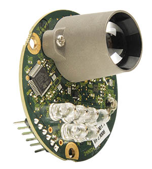

# LeddarOne 激光雷达

[LeddarOne](https://leddartech.com/solutions/leddarone/) is small Lidar module with a narrow, yet diffuse beam that offers excellent overall detection range and performance, in a robust, reliable, cost-effective package.
It has a sensing range from 1cm to 40m and needs to be connected to a UART/serial bus.



## 硬件安装

LeddarOne can be connected to any unused _serial port_ (UART), e.g.: TELEM2, TELEM3, GPS2 etc.

Build a cable following your board and pinout and LeddarOne pinout (shown below). You only will need to connect 5V, TX, RX and GND pins.

| 针脚 | LeddarOne |
| -- | --------- |
| 1  | GND       |
| 2  | -         |
| 3  | VCC       |
| 4  | RX        |
| 5  | TX        |
| 6  | -         |

## Parameter Setup

[Configure the serial port](../peripherals/serial_configuration.md) on which the lidar will run using [SENS_LEDDAR1_CFG](../advanced_config/parameter_reference.md#SENS_LEDDAR1_CFG).
There is no need to set the baud rate for the port, as this is configured by the driver.

:::info
If the configuration parameter is not available in _QGroundControl_ then you may need to [add the driver to the firmware](../peripherals/serial_configuration.md#parameter_not_in_firmware):

```plain
CONFIG_DRIVERS_DISTANCE_SENSOR_LEDDAR_ONE=y
```

:::

## 更多信息

- [LeddarOne Spec sheet](https://leddartech.com/app/uploads/dlm_uploads/2021/04/Spec-Sheet_LeddarOne_V10.0_EN-1.pdf)
