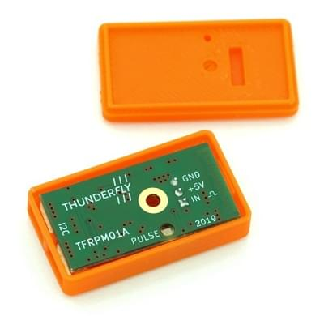

# 转速计（转数计数器）

Tachometers (also known as [revolution-counter sensors](https://en.wikipedia.org/wiki/Tachometer#In_automobiles,_trucks,_tractors_and_aircraft)) can be used to measure the rate of rotation turning vehicle parts like rotors, engines, or wheels.

:::info
Currently PX4 just logs RPM data: it is not used for state estimation or control.
:::

本节列出了 PX4 支持的转速计传感器（更详细的文档点击链接）。
更详细的设置和配置信息在下方（和侧边栏）的主题链接中提供

## 支持的硬件

- [ThunderFly TFRPM01 Tachometer](../sensor/thunderfly_tachometer.md)
