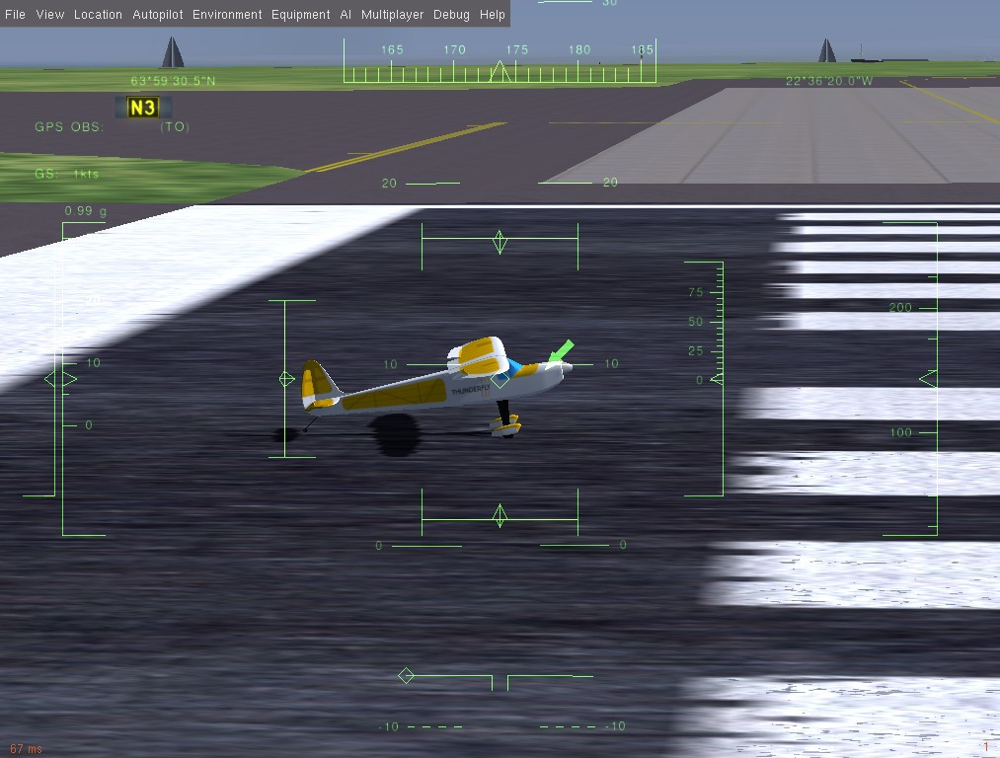

# FlightGear 仿真

:::warning
This simulator is [community supported and maintained](../simulation/community_supported_simulators.md).
It may or may not work with current versions of PX4.

See [Toolchain Installation](../dev_setup/dev_env.md) for information about the environments and tools supported by the core development team.
:::

[FlightGear](https://www.flightgear.org/) is a flight simulator with powerful [FDM engines](http://wiki.flightgear.org/Flight_Dynamics_Model).
This allows FlightGear to simulate rotorcrafts under various meteorological conditions (which is why the bridge was originally developed by [ThunderFly s.r.o.](https://www.thunderfly.cz/)).

This page describes FlightGear's single-vehicle use in SITL.
For information about multi-vehicle use see: [Multi-Vehicle Simulation with FlightGear](../sim_flightgear/multi_vehicle.md).

**Supported Vehicles:** Autogyro, Plane, Rover.

<lite-youtube videoid="iqdcN5Gj4wI" title="[ThunderFly] PX4 SITL with Flightgear, Rascal110 - electric version"/>

[](https://mermaid-js.github.io/mermaid-live-editor/#/edit/eyJjb2RlIjoiZ3JhcGggTFI7XG4gIEZsaWdodEdlYXIgLS0-IEZsaWdodEdlYXItQnJpZGdlO1xuICBGbGlnaHRHZWFyLUJyaWRnZSAtLT4gTUFWTGluaztcbiAgTUFWTGluayAtLT4gUFg0X1NJVEw7XG5cdCIsIm1lcm1haWQiOnsidGhlbWUiOiJkZWZhdWx0In0sInVwZGF0ZUVkaXRvciI6ZmFsc2V9)

<!-- Original mermaid graph
graph LR;
  FlightGear-- >FlightGear-Bridge;
  FlightGear-Bridge-- >MAVLink;
  MAVLink-- >PX4_SITL;
-->

:::info
See [Simulation](../simulation/index.md) for general information about simulators, the simulation environment, and simulation configuration (e.g. supported vehicles).
:::

## Installation (Ubuntu Linux)

:::info
These instructions were tested on Ubuntu 18.04
:::

1. Install the usual [Development Environment on Ubuntu LTS / Debian Linux](../dev_setup/dev_env_linux_ubuntu.md).

2. Install FlightGear:

  ```sh
  sudo add-apt-repository ppa:saiarcot895/flightgear
  sudo apt update
  sudo apt install flightgear
  ```

  This installs the latest stable FlightGear version from the PAA repository along with the FGdata package.

  :::tip
  For some models (e.g. those with electric engines) the daily build with the newest features may be necessary.
  Install this using the [daily build PPA](https://launchpad.net/~saiarcot895/+archive/ubuntu/flightgear-edge).

:::

3. Check that you are able to run FlightGear:

  ```sh
  fgfs --launcher
  ```

4. Set write permissions to the **Protocols** folder in the FlightGear installation directory:

  ```sh
  sudo chmod a+w /usr/share/games/flightgear/Protocol
  ```

  Setting the permissions is required because the PX4-FlightGear-Bridge puts the communication definition file here.

Additional installation instructions can be found on [FlightGear wiki](http://wiki.flightgear.org/Howto:Install_Flightgear_from_a_PPA).

## Running the Simulation

Run a simulation by starting PX4 SITL, specifying the airframe configuration of your choice.

The easiest way to do this is to open a terminal in the root directory of the PX4 _PX4-Autopilot_ repository and call `make` for the desired target.
For example, to start a plane simulation :

```sh
cd /path/to/PX4-Autopilot
make px4_sitl_nolockstep flightgear_rascal
```

The supported vehicles and `make` commands are listed below (click on the links to see the vehicle images).

| Vehicle                                                                                                      | 通信                                           |
| ------------------------------------------------------------------------------------------------------------ | -------------------------------------------- |
| [Standard Plane](../sim_flightgear/vehicles.md#standard-plane)                                               | `make px4_sitl_nolockstep flightgear_rascal` |
| [Ackermann vehicle (UGV/Rover)](../sim_flightgear/vehicles.md#ackerman-vehicle-ugv-rover) | `make px4_sitl_nolockstep flightgear_tf-r1`  |
| [Autogyro](../sim_flightgear/vehicles.md#autogyro)                                                           | `make px4_sitl_nolockstep flightgear_tf-g1`  |

The commands above launch a single vehicle with the full UI.
_QGroundControl_ should be able to automatically connect to the simulated vehicle.

:::info
For the full list of FlightGear build targets (highlighted) run:

```sh
make px4_sitl_nolockstep list_vmd_make_targets | grep flightgear_
```

For additional information see: [FlightGear Vehicles](../sim_flightgear/vehicles.md) (this includes information about "unsupported" vehicles, and adding new vehicles).
:::

:::info
The [Installing Files and Code](../dev_setup/dev_env.md) guide is a useful reference if there are build errors.
:::

## Taking it to the Sky

The `make` commands mentioned above first build PX4 and then run it along with the FlightGear simulator.

Once the PX4 has started it will launch the PX4 shell as shown below.
You must select enter to get the command prompt.

```sh
______  __   __    ___
| ___ \ \ \ / /   /   |
| |_/ /  \ V /   / /| |
|  __/   /   \  / /_| |
| |     / /^\ \ \___  |
\_|     \/   \/     |_/

px4 starting.

INFO  [px4] Calling startup script: /bin/sh etc/init.d-posix/rcS 0
INFO  [param] selected parameter default file eeprom/parameters_1034
I'm Mavlink to FlightGear Bridge
Target Bridge Freq: 200, send data every step: 1
4
  5   -1
  7   -1
  2   1
  4   1
[param] Loaded: eeprom/parameters_1034
INFO  [dataman] Unknown restart, data manager file './dataman' size is 11798680 bytes
INFO  [simulator] Waiting for simulator to accept connection on TCP port 4560
INFO  [simulator] Simulator connected on TCP port 4560.
INFO  [commander] LED: open /dev/led0 failed (22)
INFO  [commander] Mission #3 loaded, 9 WPs, curr: 8
INFO  [mavlink] mode: Normal, data rate: 4000000 B/s on udp port 18570 remote port 14550
INFO  [airspeed_selector] No airspeed sensor detected. Switch to non-airspeed mode.
INFO  [mavlink] mode: Onboard, data rate: 4000000 B/s on udp port 14580 remote port 14540
INFO  [mavlink] mode: Onboard, data rate: 4000 B/s on udp port 14280 remote port 14030
INFO  [logger] logger started (mode=all)
INFO  [logger] Start file log (type: full)
INFO  [logger] Opened full log file: ./log/2020-04-28/22_03_36.ulg
INFO  [mavlink] MAVLink only on localhost (set param MAV_{i}_BROADCAST = 1 to enable network)
INFO  [px4] Startup script returned successfully
pxh> StatsHandler::StatsHandler() Setting up GL2 compatible shaders
Now checking for plug-in osgPlugins-3.4.1/osgdb_nvtt.so
PX4 Communicator: PX4 Connected.

pxh>
```

The console will print out status as PX4 loads the airframe-specific initialization and parameter files, wait for (and connect to) the simulator.
Once there is an INFO print that [ecl/EKF] is `commencing GPS fusion` the vehicle is ready to arm.
At this point, you should see a FlightGear window with some view of aircraft.

:::info
You can change the view by pressing **Ctrl+V**.
:::



You can bring it into the air by typing:

```sh
pxh> commander takeoff
```

## Usage/Configuration Options

You can tune your FG installation/settings by the following environment variables:

- `FG\_BINARY` - absolute path to FG binary to run. (It can be an AppImage)
- `FG\_MODELS\_DIR` - absolute path to the folder containing the manually-downloaded aircraft models which should be used for simulation.
- `FG\_ARGS\_EX` - any additional FG parameters.

<a id="frame_rate"></a>

### Display the frame rate

In FlightGear you can display the frame rate by enabling it in: **View > View Options > Show frame rate**.

### Set Custom Takeoff Location

Takeoff location in SITL FlightGear can be set using additional variables.
Setting the variable will override the default takeoff location.

The variables which can be set are as follows: `--airport`, `--runway`, and `--offset-distance`.
Other options can be found on [FlightGear wiki](http://wiki.flightgear.org/Command_line_options#Initial_Position_and_Orientation)

例如：

```sh
FG_ARGS_EX="--airport=PHNL"  make px4_sitl_nolockstep flightgear_rascal
```

The example above starts the simulation on the [Honolulu international airport](http://wiki.flightgear.org/Suggested_airports)

### Using a Joystick

Joystick and thumb-joystick are supported through _QGroundControl_ ([setup instructions here](../simulation/index.md#joystick-gamepad-integration)).

The joystick input in FlightGear should be disabled in otherwise there will be a "race condition" between the FG joystick input and PX4 commands.

## Extending and Customizing

To extend or customize the simulation interface, edit the files in the **Tools/simulation/flightgear/flightgear_bridge** folder.
The code is available in the [PX4-FlightGear-Bridge repository](https://github.com/ThunderFly-aerospace/PX4-FlightGear-Bridge) on Github.

## 更多信息

- [PX4-FlightGear-Bridge readme](https://github.com/ThunderFly-aerospace/PX4-FlightGear-Bridge)
