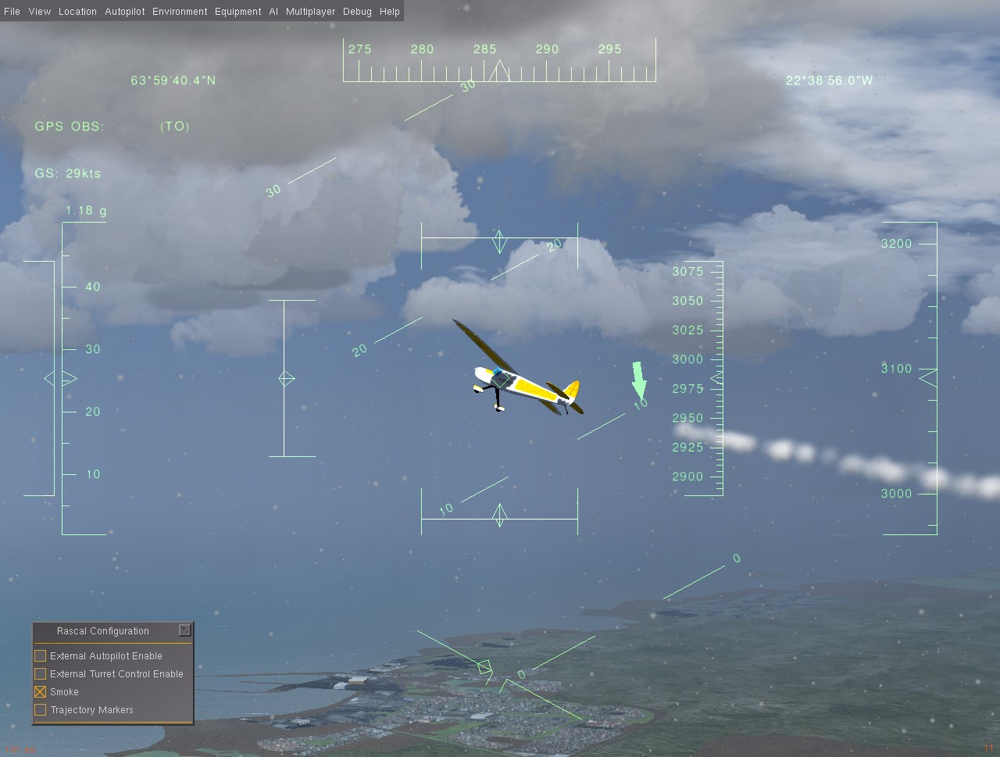
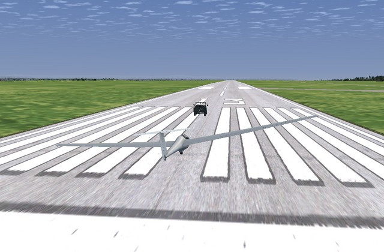

# FlightGear 机体

:::warning
This simulator is [community supported and maintained](../simulation/community_supported_simulators.md).
It may or may not work with current versions of PX4.

See [Toolchain Installation](../dev_setup/dev_env.md) for information about the environments and tools supported by the core development team.
:::

This topic lists/displays the vehicles supported by the PX4 [FlightGear](../sim_flightgear/index.md) simulation, and the `make` commands required to run them (the commands are run from terminal in the **PX4-Autopilot** directory).
The supported types are: plane, autogyro and rover (there are specific frames within these types).

:::tip
For the full list of build targets run `make px4_sitl list_vmd_make_targets` (filter out those that start with `flightgear_`).
:::

:::info
The [FlightGear](../sim_flightgear/index.md) page shows how to install and use FlightGear in more detail (this page is a summary of vehicle-specific features).
:::

## Standard Plane

FlightGear has models for many planes.
The most suitable one for UAV development is currently the [Rascal RC plane](https://github.com/ThunderFly-aerospace/FlightGear-Rascal) (which also exists in multiple variants).


The variants differ mainly by the [FDM](http://wiki.flightgear.org/Flight_Dynamics_Model) model.
All variants have a common feature selection table that can be activated by pressing the `=` key on the computer keyboard.

There is a pop-up table that could be used for advanced features activation.



The most relevant option is:

- Smoke - generates a smoke trail to enhance the visibility of aircraft in the air (smoke and particles option needs to be activated in **FG View > rendering options > Particles checkbox**).
- Trajectory markers - displays orthogonal markers along the trajectory of flight.

Trajectory markers show the absolute flight path in the world coordinates, and the smoke trail shows the relative path in the air mass.

### Rascal 110 YASim

The primary variant of the Rascal model has a combustion piston-engine model.
This results in a non-zero idle power causing a rotation of propeller on idle engine RPM.

The launch command is:

```sh
make px4_sitl_nolockstep flightgear_rascal
```

### Rascal 110 Electric YASim

A Rascal vehicle with an electric engine.

```sh
make px4_sitl_nolockstep flightgear_rascal-electric
```

:::info
This variant needs the latest FlightGear code (sources at least from 26 April 2020).
Otherwise, the FlightGear crashes because of an unexpected definition of electric engine.
:::

### Rascal 110 JSBsim

Rascal JSBsim variant.

This variant does not have a direct `make` option but can be manually selected in the **rascal.json** configuration file (part of [PX4-FlightGear-Bridge](https://github.com/ThunderFly-aerospace/PX4-FlightGear-Bridge)).
Simply change `Rascal110-YASim` to `Rascal110-JSBSim` in [this file](https://github.com/ThunderFly-aerospace/PX4-FlightGear-Bridge/blob/master/models/rascal.json#L2).

## 飞机

The only UAV autogyro model supported by FlightGear is [TF-G1 Autogyro](https://github.com/ThunderFly-aerospace/TF-G1).

```sh
make px4_sitl_nolockstep flightgear_tf-g1
```


## Ackerman vehicle (UGV/Rover)

### TF-R1 Ground support Rover

This rover is equipped with a towing hitch and might be used for aero-towing of other vehicles.

```sh
make px4_sitl_nolockstep flightgear_tf-r1
```



## Quadrotor

There is only an [incomplete multirotor model](https://github.com/ThunderFly-aerospace/FlightGear-TF-Mx1).
This is not yet usable (it is numerically unstable and needs an additional work).

## Adding a New Vehicle

A new vehicle model needs to be included as a git submodule into [PX4-FlightGear-Bridge/models/](https://github.com/PX4/PX4-FlightGear-Bridge/tree/master/models) directory.
This directory contains an control channel definition [JSON file](https://github.com/PX4/PX4-FlightGear-Bridge/blob/master/models/rascal.json).

```json
{
  "FgModel": "Rascal110-YASim",
  "Url": "https://github.com/ThunderFly-aerospace/FlightGear-Rascal/archive/master.zip",
  "Controls": [
    ["5", "/controls/flight/aileron", "-1"],
    ["7", "/controls/flight/elevator", "-1"],
    ["2", "/controls/flight/rudder", "1"],
    ["4", "/controls/engines/engine/throttle", "1"]
  ]
}
```

The file content meaning is as follows:

- `FgModel` - a precise case sensitive name of the FlightGear model corresponding to "XXXX-set.xml" in the model directory (where XXXX is the model name).
- `Url` is optional and it is not currently used. It is intended for future use to auto-download the models from web
- `Controls` - the most important part of the process of adding a vehicle. This section contains the mapping between the PX4 mixer file and [FlightGear property tree](http://wiki.flightgear.org/Property_tree).
  - The first number in a list selects a PX4 mixer output.
  - Path string is a FlightGear variable location in the property tree.
- The last number in a list is a multiplier, allowing inversion or scaling of mixer input.

After preparing all these files a new vehicle need to be included in the PX4 make system.

The PX4 configuration is in [/platforms/posix/cmake/sitl_target.cmake](https://github.com/PX4/PX4-Autopilot/blob/c5341da8137f460c84f47f0e38293667ea69a6cb/platforms/posix/cmake/sitl_target.cmake#L164-L171).
The new vehicle's json name should be added to the list.
