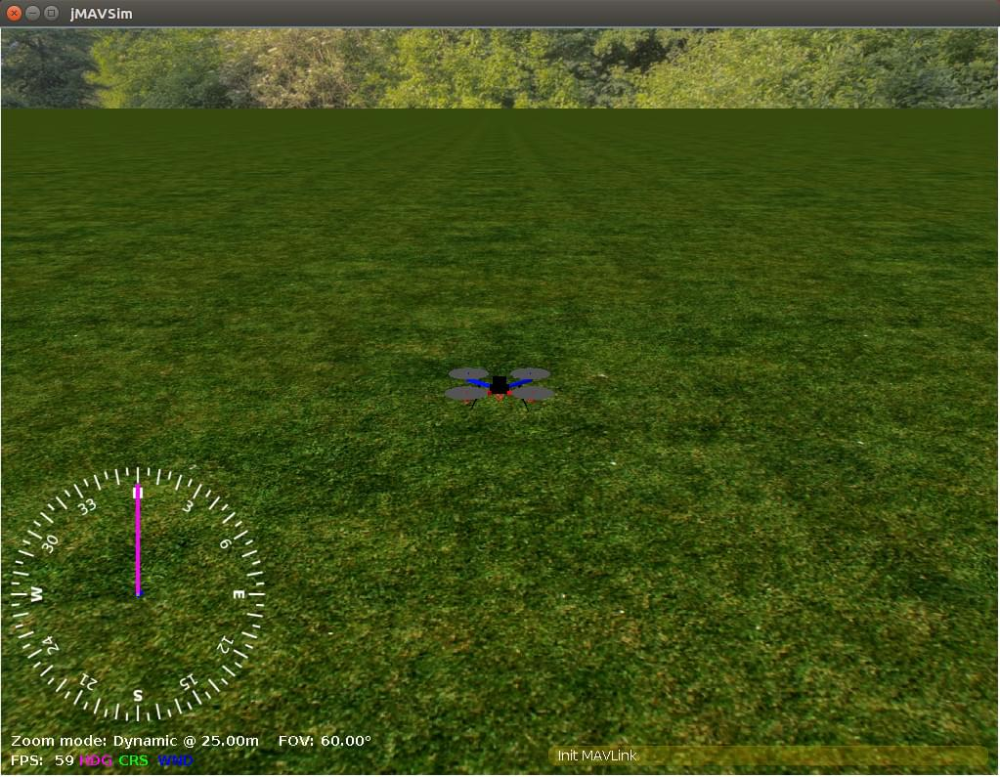

# jMAVSim with SITL

:::warning
This simulator is [community supported and maintained](../simulation/community_supported_simulators.md).
It may or may not work with current versions of PX4 and may be removed in future releases.

See [Toolchain Installation](../dev_setup/dev_env.md) for information about the environments and tools supported by the core development team.
:::

jMAVSim is a simple multirotor/Quad simulator that allows you to fly _copter_ type vehicles running PX4 around a simulated world.
It is easy to set up and can be used to test that your vehicle can take off, fly, land, and responds appropriately to various fail conditions (e.g. GPS failure).

<strong>Supported Vehicles:</strong>

- Quad

This topic shows how to set up jMAVSim to connect with a SITL version of PX4.

:::tip
jMAVSim can also be used for HITL Simulation ([as shown here](../simulation/hitl.md#jmavsim-quadrotor-only)).
:::

## 安装

jMAVSim setup is included in our [standard build instructions](../dev_setup/dev_env.md) for Ubuntu Linux and Windows.
Follow the instructions below to install jMAVSim on macOS.

### macOS

To setup the environment for [jMAVSim](../sim_jmavsim/index.md) simulation:

1. Install a recent version of Java (e.g. Java 15).
  You can download [Java 15 (or later) from Oracle](https://www.oracle.com/java/technologies/javase-downloads.html) or use [Eclipse Temurin](https://adoptium.net):

  ```sh
  brew install --cask temurin
  ```

2. Install jMAVSim:

  ```sh
  brew install px4-sim-jmavsim
  ```

  :::warning
  PX4 v1.11 and beyond require at least JDK 15 for jMAVSim simulation.

  For earlier versions, macOS users might see the error `Exception in thread "main" java.lang.UnsupportedClassVersionError:`.
  You can find the fix in the [jMAVSim with SITL > Troubleshooting](../sim_jmavsim/index.md#troubleshooting)).

:::

## Simulation Environment

Software in the Loop Simulation runs the complete system on the host machine and simulates the autopilot. It connects via local network to the simulator. The setup looks like this:

[](https://mermaid-js.github.io/mermaid-live-editor/#/edit/eyJjb2RlIjoiZ3JhcGggTFI7XG4gIFNpbXVsYXRvci0tPk1BVkxpbms7XG4gIE1BVkxpbmstLT5TSVRMOyIsIm1lcm1haWQiOnsidGhlbWUiOiJkZWZhdWx0In0sInVwZGF0ZUVkaXRvciI6ZmFsc2V9)

<!-- original graph
graph LR;
  Simulator-- >MAVLink;
  MAVLink-- >SITL;
-->

## Running SITL

After ensuring that the [simulation prerequisites](../dev_setup/dev_env.md) are installed on the system, just launch: The convenience make target will compile the POSIX host build and run the simulation.

```sh
make px4_sitl_default jmavsim
```

This will bring up the PX4 shell:

```sh
[init] shell id: 140735313310464
[init] task name: px4

______  __   __    ___
| ___ \ \ \ / /   /   |
| |_/ /  \ V /   / /| |
|  __/   /   \  / /_| |
| |     / /^\ \ \___  |
\_|     \/   \/     |_/

Ready to fly.


pxh>
```

It will also bring up a window showing a 3D view of the [jMAVSim](https://github.com/PX4/jMAVSim) simulator:



## Taking it to the Sky

The system will start printing status information. You will be able to start flying once you have a position lock (shortly after the console displays the message: _EKF commencing GPS fusion_).

To takeoff enter the following into the console:

```sh
pxh> commander takeoff
```

You can use _QGroundControl_ to fly a mission or to connect to a [joystick](#using-a-joystick).

## Usage/Configuration Options

Options that apply to all simulators are covered in the top level [Simulation](../simulation/index.md#sitl-simulation-environment) topic (some of these may be duplicated below).

### Simulating Sensor/Hardware Failure

[Simulate Failsafes](../simulation/failsafes.md) explains how to trigger safety failsafes like GPS failure and battery drain.

### Set Custom Takeoff Location

The default takeoff location in can be overridden using the environment variables: `PX4_HOME_LAT`, `PX4_HOME_LON`, and `PX4_HOME_ALT`.

For example, to set the latitude, longitude and altitude:

```sh
export PX4_HOME_LAT=28.452386
export PX4_HOME_LON=-13.867138
export PX4_HOME_ALT=28.5
make px4_sitl_default jmavsim
```

### Change Simulation Speed

The simulation speed can be increased or decreased with respect to realtime using the environment variable `PX4_SIM_SPEED_FACTOR`.

To run at double real-time:

```sh
PX4_SIM_SPEED_FACTOR=2 make px4_sitl_default jmavsim
```

To run at half real-time:

```sh
PX4_SIM_SPEED_FACTOR=0.5  make px4_sitl_default jmavsim
```

To apply a factor to all SITL runs in the current session, use `EXPORT`:

```sh
export PX4_SIM_SPEED_FACTOR=2
make px4_sitl_default jmavsim
```

### Using a Joystick

Joystick and thumb-joystick support are supported through _QGroundControl_ ([setup instructions here](../simulation/index.md#joystick-gamepad-integration)).

### Simulating a Wifi Drone

There is a special target to simulate a drone connected via Wifi on the local network:

```sh
make broadcast jmavsim
```

The simulator broadcasts its address on the local network as a real drone would do.

### Start JMAVSim and PX4 Separately

You can start JMAVSim and PX4 separately:

```sh
./Tools/simulation/jmavsim/jmavsim_run.sh -l
make px4_sitl none
```

This allows a faster testing cycle (restarting jMAVSim takes significantly more time).

### Headless Mode

To start jMAVSim without the GUI, set the env variable `HEADLESS=1` as shown:

```sh
HEADLESS=1 make px4_sitl jmavsim
```

## 基于gazebo的多飞行器仿真

JMAVSim can be used for multi-vehicle simulation: [Multi-Vehicle Sim with JMAVSim](../sim_jmavsim/multi_vehicle.md).

## Lockstep

PX4 SITL and jMAVSim have been set up to run in _lockstep_.
What this means is that PX4 and the simulator run at the same speed, and therefore can react appropriately to sensor and actuator messages.
Lockstep makes it possible to [change the simulation speed](#change-simulation-speed), and also to pause it in order to step through code.

#### Lockstep Sequence

The sequence of steps for lockstep are:

1. The simulation sends a sensor message [HIL_SENSOR](https://mavlink.io/en/messages/common.html#HIL_SENSOR) including a timestamp `time_usec` to update the sensor state and time of PX4.
2. PX4 receives this and does one iteration of state estimation, controls, etc. and eventually sends an actuator message [HIL_ACTUATOR_CONTROLS](https://mavlink.io/en/messages/common.html#HIL_ACTUATOR_CONTROLS).
3. The simulation waits until it receives the actuator/motor message, then simulates the physics and calculates the next sensor message to send to PX4 again.

The system starts with a "freewheeling" period where the simulation sends sensor messages including time and therefore runs PX4 until it has initialized and responds with an actuator message.

#### Disabling Lockstep

The lockstep simulation can be disabled if, for example, SITL is to be used with a simulator that does not support this feature.
In this case the simulator and PX4 use the host system time and do not wait on each other.

To disable lockstep in:

- PX4, run `make px4_sitl_default boardconfig` and set the `BOARD_NOLOCKSTEP` "Force disable lockstep" symbol which is located under toolchain.
- jMAVSim, remove `-l` in [sitl_run.sh](https://github.com/PX4/PX4-Autopilot/blob/main/Tools/simulation/jsbsim/sitl_run.sh#L40), or make sure otherwise that the java binary is started without the `-lockstep` flag.

<!-- Relevant lines in sitl_run.sh are: -->

<!-- # Start Java simulator -->

<!-- "$src_path"/Tools/simulation/jmavsim/jmavsim_run.sh -r 250 -l & SIM_PID=$!  -->

## Extending and Customizing

To extend or customize the simulation interface, edit the files in the **Tools/jMAVSim** folder. The code can be accessed through the[jMAVSim repository](https://github.com/px4/jMAVSim) on Github.

:::info
The build system enforces the correct submodule to be checked out for all dependencies, including the simulator.
It will not overwrite changes in files in the directory, however, when these changes are committed the submodule needs to be registered in the Firmware repo with the new commit hash. To do so, `git add Tools/jMAVSim` and commit the change.
This will update the GIT hash of the simulator.
:::

## Interfacing to ROS

The simulation can be [interfaced to ROS](../simulation/ros_interface.md) the same way as onboard a real vehicle.

## Important Files

- The startup scripts are discussed in [System Startup](../concept/system_startup.md).
- The simulated root file system ("`/`" directory) is created inside the build directory here: `build/px4_sitl_default/rootfs`.

## 故障处理

### java.long.NoClassDefFoundError

```sh
Exception in thread "main" java.lang.NoClassDefFoundError: javax/vecmath/Tuple3d
at java.base/java.lang.Class.forName0(Native Method)
at java.base/java.lang.Class.forName(Class.java:374)
at org.eclipse.jdt.internal.jarinjarloader.JarRsrcLoader.main(JarRsrcLoader.java:56)
Caused by: java.lang.ClassNotFoundException: javax.vecmath.Tuple3d
at java.base/java.net.URLClassLoader.findClass(URLClassLoader.java:466)
at java.base/java.lang.ClassLoader.loadClass(ClassLoader.java:566)
at java.base/java.lang.ClassLoader.loadClass(ClassLoader.java:499)
... 3 more
Exception in thread "main" java.lang.NoClassDefFoundError: javax/vecmath/Tuple3d
at java.base/java.lang.Class.forName0(Native Method)
at java.base/java.lang.Class.forName(Class.java:374)
at org.eclipse.jdt.internal.jarinjarloader.JarRsrcLoader.main(JarRsrcLoader.java:56)
Caused by: java.lang.ClassNotFoundException: javax.vecmath.Tuple3d
at java.base/java.net.URLClassLoader.findClass(URLClassLoader.java:466)
at java.base/java.lang.ClassLoader.loadClass(ClassLoader.java:566)
at java.base/java.lang.ClassLoader.loadClass(ClassLoader.java:499)
```

This error should no longer occur once the jMAVSim submodule is [updated to newer jar libs](https://github.com/PX4/jMAVSim/pull/119) and Java 11 or Java 14 should work fine.

### An illegal reflective access operation has occurred

This warning can be ignored (it will probably be displayed but the simulation will still work correctly).

```sh
WARNING: An illegal reflective access operation has occurred
WARNING: Illegal reflective access by javax.media.j3d.JoglPipeline (rsrc:j3dcore.jar) to method sun.awt.AppContext.getAppContext()
WARNING: Please consider reporting this to the maintainers of javax.media.j3d.JoglPipeline
WARNING: Use --illegal-access=warn to enable warnings of further illegal reflective access operations
WARNING: All illegal access operations will be denied in a future release
Inconsistency detected by ld.so: dl-lookup.c: 112: check_match: Assertion version->filename == NULL || ! _dl_name_match_p (version->filename, map)' failed!
```

### java.awt.AWTError: Assistive Technology not found: org.GNOME.Accessibility.AtkWrapper

```sh
Exception in thread "main" java.lang.reflect.InvocationTargetException
at sun.reflect.NativeMethodAccessorImpl.invoke0(Native Method)
at sun.reflect.NativeMethodAccessorImpl.invoke(NativeMethodAccessorImpl.java:62)
at sun.reflect.DelegatingMethodAccessorImpl.invoke(DelegatingMethodAccessorImpl.java:43)
at java.lang.reflect.Method.invoke(Method.java:498)
at org.eclipse.jdt.internal.jarinjarloader.JarRsrcLoader.main(JarRsrcLoader.java:58)
Caused by: java.awt.AWTError: Assistive Technology not found: org.GNOME.Accessibility.AtkWrapper
at java.awt.Toolkit.loadAssistiveTechnologies(Toolkit.java:807)
at java.awt.Toolkit.getDefaultToolkit(Toolkit.java:886)
at java.awt.Window.getToolkit(Window.java:1358)
at java.awt.Window.init(Window.java:506)
at java.awt.Window.(Window.java:537)
at java.awt.Frame.(Frame.java:420)
at java.awt.Frame.(Frame.java:385)
at javax.swing.JFrame.(JFrame.java:189)
at me.drton.jmavsim.Visualizer3D.(Visualizer3D.java:104)
at me.drton.jmavsim.Simulator.(Simulator.java:157)
at me.drton.jmavsim.Simulator.main(Simulator.java:678)
```

If you see this error, try this workaround:

Edit the **accessibility.properties** file:

```sh
sudo gedit /etc/java-8-openjdk/accessibility.properties
```

and comment out the line indicated below:

```sh
#assistive_technologies=org.GNOME.Acessibility.AtkWrapper
```

For more info, check [this GitHub issue](https://github.com/PX4/PX4-Autopilot/issues/9557).
A contributor found the fix in [askubuntu.com](https://askubuntu.com/questions/695560).

### Exception in thread "main" java.lang.UnsupportedClassVersionError

When compiling jMAVsim, you might encounter the following error:

```sh
Exception in thread "main" java.lang.UnsupportedClassVersionError: me/drton/jmavsim/Simulator has been compiled by a more recent version of the Java Runtime (class file version 59.0), this version of the Java Runtime only recognizes class file versions up to 58.0
```

This error is telling you, you need a more recent version of Java in your environment.
Class file version 58 corresponds to jdk14, version 59 to jdk15, version 60 to jdk 16 etc.

To fix it under macOS, we recommend installing OpenJDK through homebrew

```sh
brew install --cask adoptopenjdk16
```
