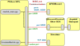

# 仿真

在仿真机中模拟器允许 px4 飞行代码来控制计算机建模工具。
You can interact with this vehicle just as you might with a real vehicle, using _QGroundControl_, an offboard API, or a radio controller/gamepad.

:::tip
Simulation is a quick, easy, and most importantly, _safe_ way to test changes to PX4 code before attempting to fly in the real world.
It is also a good way to start flying with PX4 when you haven't yet got a vehicle to experiment with.
:::

PX4 supports both _Software In the Loop (SITL)_ simulation, where the flight stack runs on computer (either the same computer or another computer on the same network) and _Hardware In the Loop (HITL)_ simulation using a simulation firmware on a real flight controller board.

Information about available simulators and how to set them up are provided in the next section.
The other sections provide general information about how the simulator works, and are not required to _use_ the simulators.

## 支持的仿真器

The following simulators are supported by the PX4 core development team.

| 仿真器                                              | 描述                                                                                                                                                                                                                                                                                                                                                                                                                                                                                                                                                                                                                                                                                                                                                   |
| ------------------------------------------------ | ---------------------------------------------------------------------------------------------------------------------------------------------------------------------------------------------------------------------------------------------------------------------------------------------------------------------------------------------------------------------------------------------------------------------------------------------------------------------------------------------------------------------------------------------------------------------------------------------------------------------------------------------------------------------------------------------------------------------------------------------------- |
| [Gazebo](../sim_gazebo_gz/index.md)              | Gazebo supersedes [Gazebo Classic](../sim_gazebo_classic/index.md), featuring more advanced rendering, physics and sensor models. It is the only version of Gazebo available from Ubuntu Linux 22.04<br><br>A powerful 3D simulation environment that is particularly suitable for testing object-avoidance and computer vision. 它还可用于 [多工具仿真](../simulation/multi-vehicle-simulation.md)，通常用于 [ROS](../simulation/ros_interface.md)，这是一种用于自动控制的工具集。 <br><br><strong>Supported Vehicles:</strong> Quad, VTOL (Standard, Tailsitter, Tiltroter), Plane, Rovers                                                                                                     |
| [Gazebo Classic](../sim_gazebo_classic/index.md) | A powerful 3D simulation environment that is particularly suitable for testing object-avoidance and computer vision. It can also be used for [multi-vehicle simulation](../simulation/multi-vehicle-simulation.md) and is commonly used with [ROS](../simulation/ros_interface.md), a collection of tools for automating vehicle control.<br><br>**Supported Vehicles:** Quad ([Iris](../airframes/airframe_reference.md#copter_quadrotor_x_generic_quadcopter)), Hex (Typhoon H480), [Generic Standard VTOL (QuadPlane)](../airframes/airframe_reference.md#vtol_standard_vtol_generic_standard_vtol), Tailsitter, Plane, Rover, Submarine |

There are also a number of [Community Supported Simulators](../simulation/community_supported_simulators.md).

---

所有模拟器都使用 Simulator MAVLink API 与 PX4 进行通信。
It is not required to _use_ the simulators.

## 仿真器 MAVLink API

All simulators except for Gazebo communicate with PX4 using the Simulator MAVLink API.
This API defines a set of MAVLink messages that supply sensor data from the simulated world to PX4 and return motor and actuator values from the flight code that will be applied to the simulated vehicle.
The image below shows the message flow.


:::info
A SITL build of PX4 uses [SimulatorMavlink.cpp](https://github.com/PX4/PX4-Autopilot/blob/main/src/modules/simulation/simulator_mavlink/SimulatorMavlink.cpp) to handle these messages while a hardware build in HIL mode uses [mavlink_receiver.cpp](https://github.com/PX4/PX4-Autopilot/blob/main/src/modules/mavlink/mavlink_receiver.cpp).
这些端口是：
All motors / actuators are blocked, but internal software is fully operational.
:::

The messages are described below (see links for specific detail).

| 消息                                                                   | 方向        | 描述                                                                              |
| -------------------------------------------------------------------- | --------- | ------------------------------------------------------------------------------- |
| [MAV\_MODE:MAV\_MODE\_FLAG\_HIL\_ENABLED][mav_mode_flag_hil_enabled] | 不可用       | 使用模拟时的模式标志。 所有电机/执行器都被卡停，但内部软件可以完全正常运行。                                         |
| [HIL\_ACTUATOR\_CONTROLS][hil_actuator_controls]                     | PX4 至 Sim | PX4 控制输出 （电机、执行器）。                                                              |
| [HIL\_SENSOR][hil_sensor]                                            | Sim 至 PX4 | 在 NED 体框架中以 SI 单位模拟 IMU 读数。                                                     |
| [HIL\_GPS][hil_gps]                                                  | Sim 至 PX4 | 模拟的 GPS RAW 传感器值。                                                               |
| [HIL\_OPTICAL\_FLOW][hil_optical_flow]                               | Sim 至 PX4 | 来自流量传感器的模拟光流 （例如 PX4FLOW 或光学鼠标传感器）。                                             |
| [HIL\_STATE\_QUATERNION][hil_state_quaternion]                       | Sim 至 PX4 | 包含实际的“仿真”无人机位置、姿态、速度等。 这可以记录并与 px4 的分析和调试估计进行比较 （例如，检查估计器在噪声 （仿真） 传感器输入中的工作情况）。 |
| [HIL\_RC\_INPUTS\_RAW][hil_rc_inputs_raw]                            | Sim 至 PX4 | 收到 RC 通道的 RAW 值。                                                                |

<!-- links for table above -->

[mav_mode_flag_hil_enabled]: https://mavlink.io/en/messages/common.html#MAV_MODE_FLAG_HIL_ENABLED
[hil_actuator_controls]: https://mavlink.io/en/messages/common.html#HIL_ACTUATOR_CONTROLS
[hil_sensor]: https://mavlink.io/en/messages/common.html#HIL_SENSOR
[hil_gps]: https://mavlink.io/en/messages/common.html#HIL_GPS
[hil_optical_flow]: https://mavlink.io/en/messages/common.html#HIL_OPTICAL_FLOW
[hil_state_quaternion]: https://mavlink.io/en/messages/common.html#HIL_STATE_QUATERNION
[hil_rc_inputs_raw]: https://mavlink.io/en/messages/common.html#HIL_RC_INPUTS_RAW

<!-- above ^^^ links for table -->

PX4 directly uses the [Gazebo API](https://gazebosim.org/docs) to interface with [Gazebo](../sim_gazebo_gz/index.md) and MAVlink is not required.

## 默认 PX4 MAVLink UDP 端口

By default, PX4 uses commonly established UDP ports for MAVLink communication with ground control stations (e.g. _QGroundControl_), Offboard APIs (e.g. MAVSDK, MAVROS) and simulator APIs (e.g. Gazebo).
These ports are:

- PX4's remote UDP Port **14550** is used for communication with ground control stations.
  期望 GCS 侦听此端口上的连接。
  _QGroundControl_ 默认侦听此端口。
- PX4's remote UDP Port **14540** is used for communication with offboard APIs.
  期望 Offboard APIs 侦听此端口上的连接。
  ::: info
  Multi-vehicle simulations use a separate remote port for each instance, allocated sequentially from `14540` to `14549`
  (additional instances all use port `14549`).

:::
- The simulator's local TCP Port, **4560**, is used for communication with PX4.
  PX4 侦听此端口，仿真器应通过向该端口广播数据来启动通信。

:::info
The ports for the GCS, offboard APIs and simulator are specified by startup scripts.
See [System Startup](../concept/system_startup.md) to learn more.
:::

<!-- A useful discussion about UDP ports here: https://github.com/PX4/PX4-user_guide/issues/1035#issuecomment-777243106 -->

## SITL 仿真环境

The diagram below shows a typical SITL simulation environment for any of the supported simulators that use MAVLink (i.e. all of them except Gazebo).



The different parts of the system connect via UDP, and can be run on either the same computer or another computer on the same network.

- PX4 uses a simulation-specific module to connect to the simulator's local TCP port 4560.
  Simulators then exchange information with PX4 using the [Simulator MAVLink API](#simulator-mavlink-api) described above.
  SITL 和模拟器上的 PX4 可以在同一台计算机上运行，也可以在同一网络上运行不同的计算机。

  ::: info
  Simulators can also use the _uxrce-dds bridge_ ([XRCE-DDS](../middleware/uxrce_dds.md)) to directly interact with PX4 (i.e. via [UORB topics](../middleware/uorb.md) rather than MAVLink).
  This approach _may_ used by Gazebo Classic for [multi-vehicle simulation](../sim_gazebo_classic/multi_vehicle_simulation.md#build-and-test-xrce-dds).

:::

- PX4 uses the normal MAVLink module to connect to ground stations and external developer APIs like MAVSDK or ROS
  - Ground stations listen to PX4's remote UDP port: `14550`
  - External developer APIs listen to PX4's remote UDP port: `14540`.
    For multi-vehicle simulations, PX4 sequentially allocates a separate remote port for each instance from `14540` to `14549` (additional instances all use port `14549`).

- PX4 defines a number of _local_ UDP ports (`14580`,`18570`), which are sometimes used when networking with PX4 running in a container or virtual machine.
  These are not recommended for "general" use and may change in future.

- A serial connection may be used to connect [Joystick/Gamepad](../config/joystick.md) hardware via _QGroundControl_.

If you use the normal build system SITL `make` configuration targets (see next section) then both SITL and the Simulator will be launched on the same computer and the ports above will automatically be configured.
You can configure additional MAVLink UDP connections and otherwise modify the simulation environment in the build configuration and initialisation files.

### 启动/构建 SITL 模拟

The build system makes it very easy to build and start PX4 on SITL, launch a simulator, and connect them.
The syntax (simplified) looks like this:

```sh
make px4_sitl simulator[_vehicle-model]
```

where `simulator` is `gz` (for Gazebo), `gazebo-classic`, `jmavsim` or some other simulator, and vehicle-model is a particular vehicle type supported by that simulator ([Gazebo](../sim_gazebo_gz/index.md) and [jMAVSim](../sim_jmavsim/index.md) only support multicopters at time of writing, while [Gazebo Classic](../sim_gazebo_classic/index.md) supports many different types).

A number of examples are shown below, and there are many more in the individual pages for each of the simulators:

```sh
# Start Gazebo with the x500 multicopter
make px4_sitl gz_x500

# Start Gazebo Classic with plane
make px4_sitl gazebo-classic_plane

# Start Gazebo Classic with iris and optical flow
make px4_sitl gazebo-classic_iris_opt_flow

# Start JMavSim with iris (default vehicle model)
make px4_sitl jmavsim

# Start PX4 with no simulator (i.e. to use your own "custom" simulator)
make px4_sitl none_iris
```

The simulation can be further configured via environment variables:

- `PX4_ESTIMATOR`: This variable configures which estimator to use.
  Possible options are: `ekf2` (default), `lpe` (deprecated).
  It can be set via `export PX4_ESTIMATOR=lpe` before running the simulation.

The syntax described here is simplified, and there are many other options that you can configure via _make_ - for example, to set that you wish to connect to an IDE or debugger.
For more information see: [Building the Code > PX4 Make Build Targets](../dev_setup/building_px4.md#px4-make-build-targets).

### Run Simulation Faster than Realtime {#simulation_speed}

SITL can be run faster or slower than real-time when using Gazebo, Gazebo Classic, or jMAVSim.

The speed factor is set using the environment variable `PX4_SIM_SPEED_FACTOR`.

:::info
PX4 SITL and the simulators are run in _lockstep_, which means that they are locked to run at the same speed, and therefore can react appropriately to sensor and actuator messages.
This is what makes it possible to run the simulation at different speeds, and also pause the simulation in order to step through code.
:::

有关详细信息，请参阅︰

- Gazebo: [Change Simulation Speed](../sim_gazebo_gz/index.md#change-simulation-speed)
- Gazebo Classic: [Change Simulation Speed](../sim_gazebo_classic/index.md#change-simulation-speed) and [Lockstep](../sim_gazebo_classic/index.md#lockstep)
- jMAVSim: [Change Simulation Speed](../sim_jmavsim/index.md#change-simulation-speed) and [Lockstep](../sim_jmavsim/index.md#lockstep)

### 启动脚本

Scripts are used to control which parameter settings to use or which modules to start.
They are located in the [ROMFS/px4fmu_common/init.d-posix](https://github.com/PX4/PX4-Autopilot/tree/main/ROMFS/px4fmu_common/init.d-posix) directory, the `rcS` file is the main entry point.
See [System Startup](../concept/system_startup.md) for more information.

### Simulating Failsafes and Sensor/Hardware Failure

[Simulate Failsafes](../simulation/failsafes.md) explains how to trigger safety failsafes like GPS failure and battery drain.

## HITL 仿真环境

硬件在环仿真（HITL）模式下标准的 PX4 固件在真实的硬件上运行。
The HITL Simulation Environment in documented in: [HITL Simulation](../simulation/hitl.md).

## 操纵杆／手柄集成

_QGroundControl_ desktop versions can connect to a USB Joystick/Gamepad and send its movement commands and button presses to PX4 over MAVLink.
相反，它将数据包路由到 "本地主机"。
If you don't have a joystick you can alternatively control the vehicle using QGroundControl's onscreen virtual thumbsticks.

For setup information see the _QGroundControl User Guide_:

- [Joystick Setup](https://docs.qgroundcontrol.com/master/en/qgc-user-guide/setup_view/joystick.html)
- [Virtual Joystick](https://docs.qgroundcontrol.com/master/en/qgc-user-guide/settings_view/virtual_joystick.html)

<!-- FYI Airsim info on this setting up remote controls: https://github.com/Microsoft/AirSim/blob/master/docs/remote_controls.md -->

## 相机模拟

PX4 supports capture of both still images and video from within the [Gazebo Classic](../sim_gazebo_classic/index.md) simulated environment.
This can be enabled/set up as described in [Gazebo Glassic > Video Streaming](../sim_gazebo_classic/index.md#video-streaming).

The simulated camera is a gazebo classic plugin that implements the [MAVLink Camera Protocol](https://mavlink.io/en/protocol/camera.html) <!-- **PX4-Autopilot/Tools/simulation/gazebo-classic/sitl_gazebo-classic/src/gazebo_geotagged_images_plugin.cpp -->.
PX4 connects/integrates with this camera in _exactly the same way_ as it would with any other MAVLink camera:

1. [TRIG_INTERFACE](../advanced_config/parameter_reference.md#TRIG_INTERFACE) must be set to `3` to configure the camera trigger driver for use with a MAVLink camera
  :::tip
  In this mode the driver just sends a [CAMERA_TRIGGER](https://mavlink.io/en/messages/common.html#CAMERA_TRIGGER) message whenever an image capture is requested.
  For more information see [Cameras Connected to Flight Controller Outputs](../camera/fc_connected_camera.md).

:::
2. PX4 必须在 GCS 和（模拟器）MAVLink Camera 之间转发所有摄像机命令。
  You can do this by starting [MAVLink](../modules/modules_communication.md#mavlink) with the `-f` flag as shown, specifying the UDP ports for the new connection.

  ```sh
  mavlink start -u 14558 -o 14530 -r 4000 -f -m camera
  ```

  ::: info
  More than just the camera MAVLink messages will be forwarded, but the camera will ignore those that it doesn't consider relevant.

:::

The same approach can be used by other simulators to implement camera support.

## 在远程服务器上运行仿真

It is possible to run the simulator on one computer, and access it from another computer on the same network (or on another network with appropriate routing).
This might be useful, for example, if you want to test a drone application running on real companion computer hardware running against a simulated vehicle.

This does not work "out of the box" because PX4 does not route packets to external interfaces by default (in order to avoid spamming the network and different simulations interfering with each other).
Instead it routes traffic internally - to "localhost".

There are a number of ways to make the UDP packets available on external interfaces, as outlined below.

### 启用 MAV_BROADCAST

The [mavlink-router](https://github.com/mavlink-router/mavlink-router) can be used to route packets from localhost to an external interface.

To route packets between SITL running on one computer (sending MAVLink traffic to localhost on UDP port 14550), and QGC running on another computer (e.g. at address `10.73.41.30`) you could:

- Start _mavlink-router_ with the following command:

  ```sh
  mavlink-routerd -e 10.73.41.30:14550 127.0.0.1:14550
  ```

- Use a _mavlink-router_ conf file.

  ```ini
  [UdpEndpoint QGC]
  Mode = Normal
  Address = 10.73.41.30
  Port = 14550

  [UdpEndpoint SIM]
  Mode = Eavesdropping
  Address = 127.0.0.1
  Port = 14550
  ```

:::info
More information about _mavlink-router_ configuration can be found [here](https://github.com/mavlink-router/mavlink-router#running).
:::

### 使用 MAVLink 路由器

The [mavlink module](../modules/modules_communication.md#mavlink_usage) routes to _localhost_ by default, but you can enable UDP broadcasting of heartbeats using its `-p` option.
Any remote computer on the network can then connect to the simulator by listening to the appropriate port (i.e. 14550 for _QGroundControl_).

:::info
UDP broadcasting provides a simple way to set up the connection when there is only one simulation running on the network.
Do not use this approach if there are multiple simulations running on the network (you might instead [publish to a specific address](#enable-streaming-to-specific-address)).
:::

This should be done in an appropriate configuration file where `mavlink start` is called.
For example: [/ROMFS/px4fmu_common/init.d-posix/px4-rc.mavlink](https://github.com/PX4/PX4-Autopilot/blob/main/ROMFS/px4fmu_common/init.d-posix/px4-rc.mavlink).

### 修改外部广播的配置

The [mavlink module](../modules/modules_communication.md#mavlink_usage) routes to _localhost_ by default, but you can specify an external IP address to stream to using its `-t` option.
The specified remote computer can then connect to the simulator by listening to the appropriate port (i.e. 14550 for _QGroundControl_).

This should be done in various configuration files where `mavlink start` is called.
For example: [/ROMFS/px4fmu_common/init.d-posix/px4-rc.mavlink](https://github.com/PX4/PX4-Autopilot/blob/main/ROMFS/px4fmu_common/init.d-posix/px4-rc.mavlink).

### SSH 通道

SSH tunneling is a flexible option because the simulation computer and the system using it need not be on the same network.

:::info
You might similarly use VPN to provide a tunnel to an external interface (on the same network or another network).
:::

One way to create the tunnel is to use SSH tunneling options.
The tunnel itself can be created by running the following command on _localhost_, where `remote.local` is the name of a remote computer:

```sh
ssh -C -fR 14551:localhost:14551 remote.local
```

The UDP packets need to be translated to TCP packets so they can be routed over SSH.
The [netcat](https://en.wikipedia.org/wiki/Netcat) utility can be used on both sides of the tunnel - first to convert packets from UDP to TCP, and then back to UDP at the other end.

:::tip
QGC must be running before executing _netcat_.
:::

On the _QGroundControl_ computer, UDP packet translation may be implemented by running following commands:

```sh
mkfifo /tmp/tcp2udp
netcat -lvp 14551 < /tmp/tcp2udp | netcat -u localhost 14550 > /tmp/tcp2udp
```

On the simulator side of the SSH tunnel, the command is:

```sh
mkfifo /tmp/udp2tcp
netcat -lvup 14550 < /tmp/udp2tcp | netcat localhost 14551 > /tmp/udp2tcp
```

The port number `14550` is valid for connecting to QGroundControl or another GCS, but should be adjusted for other endpoints (e.g. developer APIs etc.).

The tunnel may in theory run indefinitely, but _netcat_ connections may need to be restarted if there is a problem.

The [QGC_remote_connect.bash](https://raw.githubusercontent.com/ThunderFly-aerospace/sitl_gazebo/autogyro-sitl/scripts/QGC_remote_connect.bash) script can be run on the QGC computer to automatically setup/run the above instructions.
The simulation must already be running on the remote server, and you must be able to SSH into that server.
