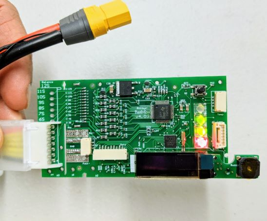
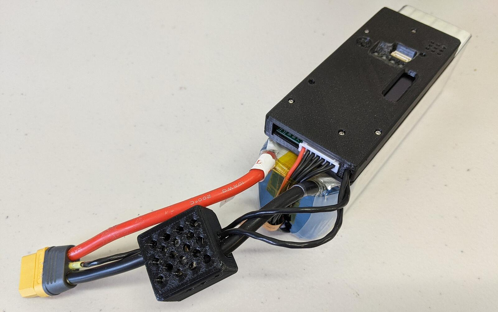
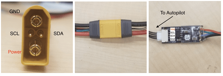

# 补充信息

[Rotoye Batmon](https://shop.rotoye.com/batmon/) is a kit for adding smart battery functionality to off-the-shelf Lithium-Ion and LiPo batteries.
It can be purchased as a standalone unit or as part of a factory-assembled smart-battery.





## 购买渠道

[Rotoye Store](https://shop.rotoye.com/batmon/): Batmon kits, custom smart-batteries, and accessories

## Wiring/Connections

Rotoye 电池监测系统系统采用带有 I2C 引脚的 XT - 90 电池连接器，以及一块光隔离板来传输数据。



更多详细信息在[这里](https://github.com/rotoye/batmon_reader)可以找到

## 软件设置

### Build PX4 Firmware

1. 克隆或下载 [Rotoye的 PX4 分支：](https://github.com/rotoye/PX4-Autopilot/tree/batmon_4.03)
   ```sh
   git clone https://github.com/rotoye/PX4-Autopilot.git
   cd PX4-Autopilot
   ```
2. Checkout the _batmon_4.03_ branch
   ```sh
   git fetch origin batmon_4.03
   git checkout batmon_4.03
   ```
3. [Build and upload the firmware](../dev_setup/building_px4.md) for your target board

### Configure Parameters

In _QGroundControl_:

1. Set the following [parameters](../advanced_config/parameters.md):
   - `BATx_SOURCE` to `External`,
   - `SENS_EN_BAT` to `true`,
   - `BAT_SMBUS_MODEL` to `3:Rotoye`
2. Open the [MAVLink Console](https://docs.qgroundcontrol.com/master/en/qgc-user-guide/analyze_view/mavlink_console.html)
3. Start the [batt_smbus driver](../modules/modules_driver.md) in the console.
   For example, to run two BatMons on the same bus:
   ```sh
   batt_smbus start -X -b 1 -a 11 # External bus 1, address 0x0b
   batt_smbus start -X -b 1 -a 12 # External bus 1, address 0x0c
   ```
