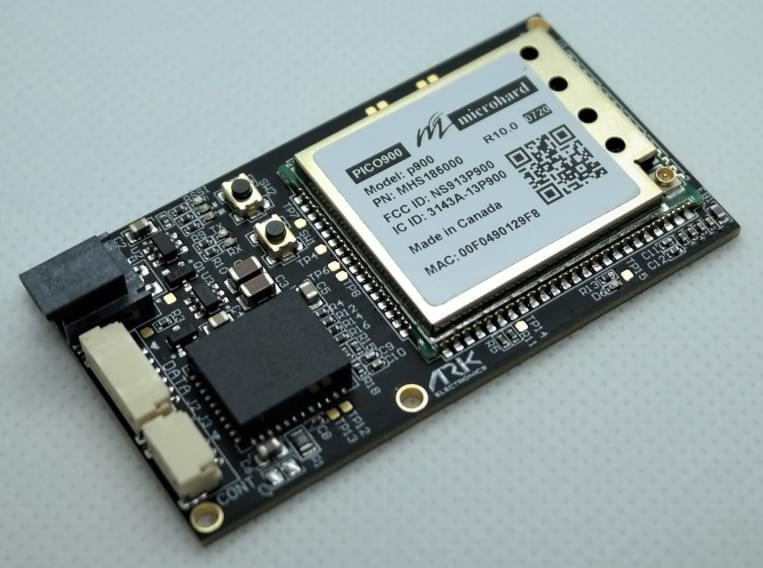
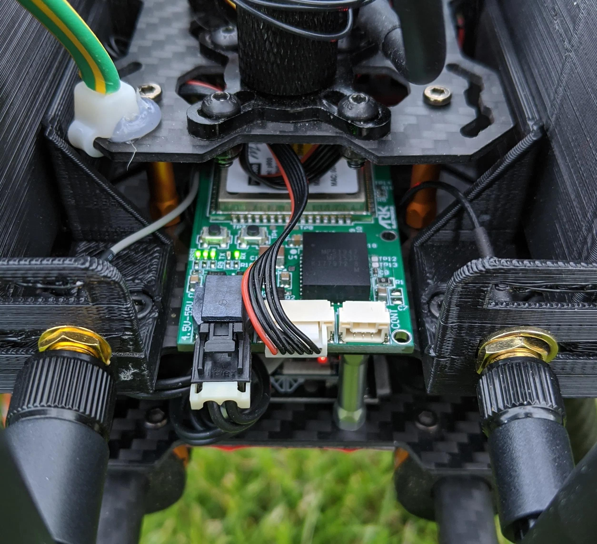
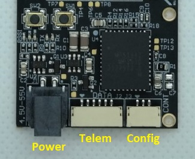
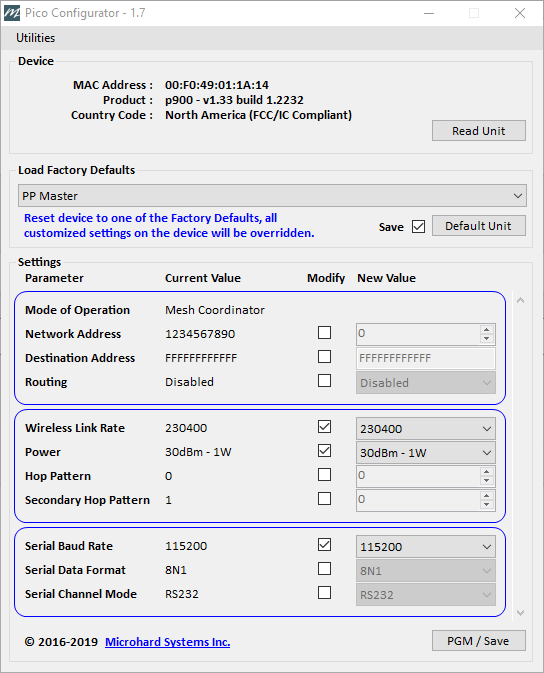

# ARK Electron Microhard Serial Telemetry Radios

_ARK Electron Microhard Serial Telemetry Radios_ integrate the [Microhard Pico Serial](http://microhardcorp.com/P900.php) P900 RF module.
This can be used to enable MAVLink communication between a radio on a vehicle and a GCS.

Microhard Pico Serial radios are (up to) 1 Watt output radios that support point to point, point to multi-point, and mesh modes.
The Microhard Pico radios can also be ordered with AES-256 encryption.

The approximate range with output power set to 1W is 8km (5miles) when using default settings.
A single ground station radio can be used to communicate with multiple vehicles using point to multi-point or mesh.
Vehicles must have different MAVLINK IDs.

## 购买渠道

- [1W 900MHz Serial Telemetry Radio](https://arkelectron.com/product/1w-900mhz-serial-telemetry-air-radio/) (vehicle)
- [1W 900MHz USB Serial Telemetry Radio](https://arkelectron.com/product/1w-900mhz-serial-telemetry-ground-radio/) (ground station)
- [1W 2.4GHz Serial Telemetry Radio](https://arkelectron.com/product/1w-2400mhz-serial-telemetry-radio/) (vehicle)
- [1W 2.4GHz USB Serial Telemetry Radio](https://arkelectron.com/product/1w-2400mhz-usb-serial-telemetry-radio/) (ground station)

## Connecting

### Vehicle Radio

Connect the vehicle radio to the flight controller `TELEM1` port.
A Pixhawk-standard 6 pin JST GH telemetry cable is supplied for this purpose.

The radio can be powered by the telemetry cable if the output power is set to less than 100mW.
For higher output levels, the radio must be separately powered via the 2 Pin Molex Nano-Fit (i.e. from a battery).

### Ground Station Radio

Connect the ground radio to the ground station via USB C.
The radio does not need to be separately powered when using USB PD (1W power can be supplied).

## Setup/Configuration

The radios are default-configured to use peer-to-peer mode and a baud rate of 57600.
This allows them to connect to the PX4 `TELEM1` port and _QGroundControl_ **without any further configuration**.

:::info
You can use a different baud rate, mode or flight controller port.
The only "requirement" is that the ground radio, air radio, PX4, and QGroundControl must all be set to the same baud rate.
:::

[Microhard Serial Telemetry Radios > Configuration](../telemetry/microhard_serial.md#configuration) explains how to configure the radios, _QGroundControl_, and PX4.

The ARK Electron radios must be connected to the computer running the _PicoConfig_ configuration tool as described below:

- For vehicle radio configuration you will have to connect an FTDI adapter between the radio's 3 pin JST-GH Config port and a Windows PC running _Pico Config_ (the radio must be powered, which you can do from battery or the data connection to the flight-controller's `TELEM1` port).

  

  _Pico Config_ will automatically detect the radio.
  Adjust the baud rate setting to match PX4 (and the ground station radio).

- The ground station radio USB C connection can be used for configuring the radio (as well as for telemetry data).
  _Pico Config_ will automatically detect and connect to the configuration port.
  Adjust the settings so that the baud rate matches PX4.

Once the radios and PX4 are all configured to use the same baud rate you can connect QGroundControl to the vehicle via the radio.

### Default Configuration

The default radio configuration as shipped is shown in _PicoConfig_ below.

## 更多信息

- [Pico Config 1.7](https://arkelectron.com/wp-content/uploads/2021/04/PicoConfig-1.7.zip) - Radio configuration tool
