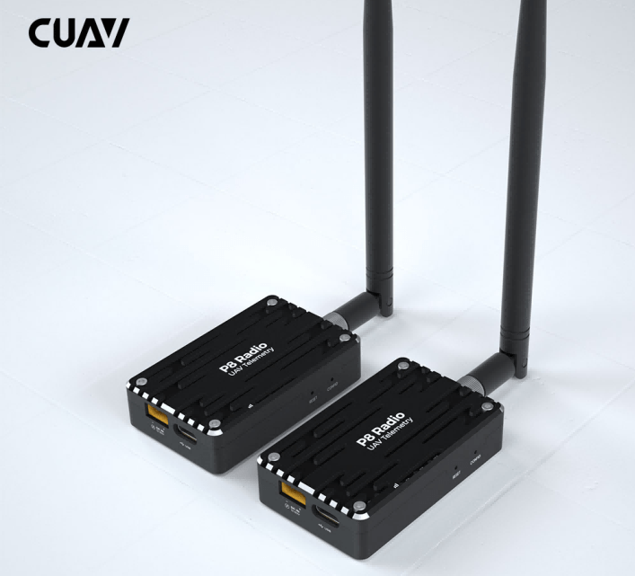
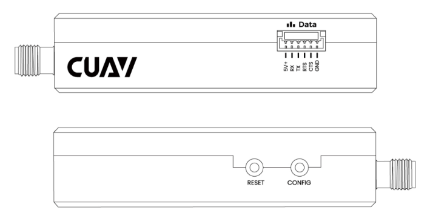
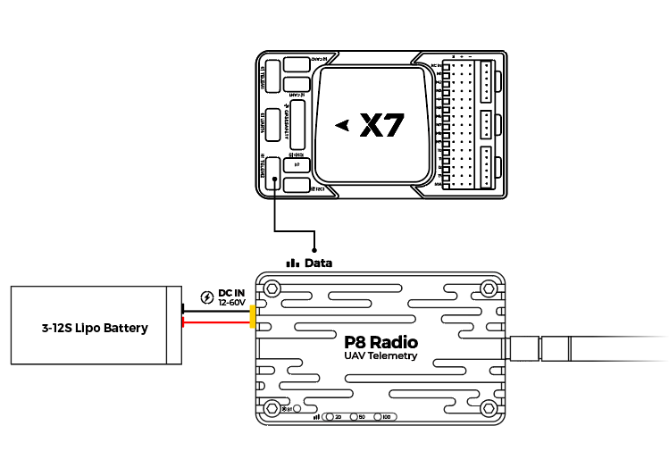

# CUAV P8 Telemetry Radio

CUAV P8 Radio is a long range (>60km) and high data rate (375 Kbps) remote data transmission module for drones that works plug-and-play with PX4.

It supports multiple modes such as point-to-point, point-to-multipoint, and relay communication.

## 主要特性

- Long range: >60km (depending on the antenna and environment, up to 100 km).
- Supports point-to-point, point-to-multipoint, and repeater modes.
- Up to 2W power (fixed frequency 2W; frequency hopping 1W)
- Up to 345 Kbps transfer rate.
- Supports 12v~60V operating voltage.
- Unit can operate either as ground station modem or aircraft modem.
- Independent power supply for more stable operation
- USB Type-C port, integrated USB to UART converter

## 购买渠道

- [CUAV store](https://www.cuav.net/en/p8-2/)
- [CUAV alibaba](https://www.alibaba.com/product-detail/Free-shipping-CUAV-UAV-P8-Radio_1600324379418.html?spm=a2747.manage.0.0.2dca71d2bY4B0M)

## PX4 配置

The CUAV P8 Radio comes pre-configured (baud rate 57600, broadcast mode) for use with PX4.
It should require no additional setup if connected to `TELEM1` OR `TELEM2`.

On some flight controllers, or if used with a different serial port, you may need to [configure the port for MAVLink communication](../peripherals/mavlink_peripherals.md).

:::tip
[P8 Configuration](https://doc.cuav.net/data-transmission/p8-radio/en/config.html) provides full information about radio configuration, if required.
:::

## 针脚定义

### Data Port

| 引脚 | C-RTK GPS 6P               | 引脚 | Pixhawk standard pins |
| -- | -------------------------- | -- | --------------------- |
| 1  | 5V+(NC) | 1  | VCC                   |
| 2  | RX                         | 2  | TX                    |
| 3  | TX                         | 3  | RX                    |
| 4  | RTS:       | 4  | RTS:  |
| 5  | CTS                        | 5  | CTS                   |
| 6  | GND                        | 6  | GND                   |

## 布线

Connect the CUAV P8 Radio to the `TELEM1`/`TELEM2` interface of the flight controller and use a battery or BEC to power the module.
The required cables are included in the package.

:::tip
CUAV P8 Radio does not support power supply from the flight controller, it needs to be connected to a 12~60v battery or BEC.
:::

## More information

[P8 manual](http://manual.cuav.net/data-transmission/p8-radio/p8-user-manual-en.pdf)

[CUAV P8 Radio](https://doc.cuav.net/data-transmission/p8-radio/en/) (Official Guide)
