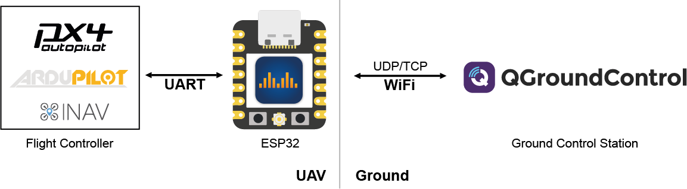

# ESP32 WiFi 模块

## 综述

ESP32 are readily available WiFi modules with dedicated UART, SPI and I2C interfaces, and full TCP/IP stack and microcontroller capability.
They usually come without firmware, but _DroneBridge for ESP32_ can be installed to enable them as a transparent and bi-directional serial to WiFi bridge.
This allows them to be used as a [WiFi telemetry](../telemetry/telemetry_wifi.md) module with any Pixhawk series controller.

They can alternatively be used in a special ESP-NOW Mode that enables ranges of up to 1km+, albeit at lower data rates.

The typical range depends on the antenna and environment:

- WiFi-Modes: ~50m-200m
- ESP-NOW Modes: 300m-1km+

### WiFi Network

_DroneBridge for ESP32_ supports standard WiFi connections to an access point but can also operate as a standalone access point.

### ESP-NOW Network

The ESP-NOW mode offers a connectionless and encrypted alternative to traditional WiFi.
While the data rate is reduced to < 250 kbit/s the range is increased up to 1 km.
This mode has no limit on how many autopilot clients are connected.
Only channel capacity and processing capacity limit the number of clients.

:::info
ESP-NOW requires ESP32 devices on the GCS side as well as on the autopilot side.
:::

## 特性

- Bidirectional: serial-to-WiFi, serial-to-WiFi Long-Range (LR), serial-to-ESP-NOW link
- Support for MAVLink, MSP, LTM or any other payload using transparent option
- Affordable, Reliable & low latency
- Weight: < 8g
- Up to 150m range using standard WiFi
- Up to 1km of range using ESP-NOW or Wi-Fi LR Mode - sender & receiver must be ESP32 with LR-Mode enabled
- Fully encrypted in all modes including ESP-NOW broadcasts secured using AES-GCM 256 bit!
- Support for drone swarms of almost any size using ESP-NOW with its custom & encrypted broadcast mode
- Supported by: QGroundControl, Mission Planner, mwptools, impload etc.
- Easy to set up: Power connection + UART connection to flight controller
- Fully configurable through an easy-to-use web interface
- Parsing of LTM & MSPv2 for more reliable connection and less packet loss
- Parsing of MAVLink with the injection of radio status packets for the display of RSSI in the GCS
- Fully transparent telemetry down-link option

:::info
[You can find all the latest information on the current version of _DroneBridge for ESP32_ on the official website.](https://dronebridge.github.io/ESP32/)
:::

## Recommended Hardware

_DroneBridge for ESP32_ can run on almost all ESP32 development boards.
Boards and modules with an external antenna connector are recommended since these will offer more range.

:::warning
Some ESP32 modules support 3.3V power supply input, while many flight controllers output at 5V (e.g. Pixhawk 4).
You will need to check compatibility and step down the voltage if needed.
:::

:::tip
The _DroneBridge for ESP32_ project recommends using [Officially Supported and Tested Boards](https://dronebridge.github.io/ESP32/).
These are small, low in price, have Pixhawk-standard port for connecting to Pixhawk flight controllers, and come with _DroneBridge for ESP32_ firmware pre-installed.
:::

Other ESP32 Boards that have been tested with versions of _DroneBridge for ESP32_ (but receive no official support):

- [ESP32-C3-DevKitM-1](https://docs.espressif.com/projects/esp-dev-kits/en/latest/esp32c3/esp32-c3-devkitm-1/index.html)
- [ESP32-S3-DevKitC-1](https://docs.espressif.com/projects/esp-dev-kits/en/latest/esp32s3/esp32-s3-devkitc-1/index.html)
- [NodeMCU ESP32S](https://www.waveshare.com/nodemcu-32s.htm)

## Installing/Updating the Firmware

An [easy-to-use online flashing tool](https://dronebridge.github.io/ESP32/install.html) is available on the official website.
Use a Chrome-based browser, connect your ESP32 via USB to your computer, and click flash!

For more detailed flashing instructions see [DroneBridge for ESP32 > Installation](https://dronebridge.gitbook.io/docs/dronebridge-for-esp32/installation) (DroneBridge Docs).

## 布线

When using one of the official boards with a Pixhawk flight controller it is as simple as plugging the provided cable from `TELEM1` on the ESP32 to the `TELEM1` or `TELEM2` port on the FC.

For ESP boards that don't have a `TELEM` port you need to manually wire to a serial port on the FC (e.g. `TELEM1` or `TELEM2`).
The diagram below provides an outline of how you would wire up the connections.

- Connect UART of ESP32 to a UART of your autopilot (ie. `TELEM1` or `TELEM2` port).
  Make sure the voltage levels match!
- RX to TX
- GND to GND
- Stable 3.3V or 5V power supply to the ESP32 (depending on the available inputs of your ESP32 and capabilities of the autopilot)
- Set the autopilot port to MAVLINK 1 or 2 protocol.

::: info

- Follow the ESP32 board manufacturer recommendations on power supply.
  Some boards might have issues if they are simultaneously connected to a 5V power source and have a USB cable connected to the USB/Serial bridge (USB socket of the ESP32 dev board).
- Some ESP32 DevKits manufacturers use the wrong labels for the pins on their products.
  Make sure that the PINs on your board are labelled correctly if you encounter issues.

:::

## Configuring PX4

Configure the Flight controller port that is wired to the ESP32 to have MAVLink set as the protocol and to have the same baud rate as the ESP32.
The Pixhawk `TELEM1` and `TELEM2` ports are configured for [MAVLink by default](../peripherals/mavlink_peripherals.md#default-mavlink-ports) but you will still need to set the rates.

For `TELEM1` you might set the values like this:

- `SER_TEL1_BAUD`: 115200 8N1
- `MAV_0_RATE`: 24000 (can be increased optionally)

For more information, and using other ports, see [MAVLink Peripherals](../peripherals/mavlink_peripherals.md) and [Serial Port Configuration](../peripherals/serial_configuration.md)

## Configuring DroneBridge for ESP32

Once _DroneBridge for ESP32_ is flashed it initially will provide a Wifi access point that you can connect to.
Once connected you can access the configuration page using your browser. The address of the configuration page is `http://dronebridge.local` or `192.168.2.1`.

The _DroneBridge for ESP32_ default configuration should work for connecting to PX4 "out of the box".
For the Official HW1.x Boards the configuration is: `UART TX Pin: 5`, `UART RX Pin: 4`, `UART RTS Pin: 6`, `UART CTS Pin: 7`

The only configuration that may be required is ensuring that the baud rates of the ESP32 and flight controller match.

You will want to change these settings if you want to use different pins on the ESP32, a different WiFi configuration, or to tweak the packet size.
A lower packet size means more overhead and load on the system, less latency, and faster recovery from a lost packet.

### Supported Modes

| **MavLink Index** | **DroneBridge for ESP32 Mode** | **Encryption**           | **Description**                                                                                                                                                                          | **Notes**                                                                                                                                                                                                                                                 |
| ----------------- | ------------------------------ | ------------------------ | ---------------------------------------------------------------------------------------------------------------------------------------------------------------------------------------- | --------------------------------------------------------------------------------------------------------------------------------------------------------------------------------------------------------------------------------------------------------- |
| 1                 | WiFi Access Point Mode         | WPA2 PSK                 | ESP32 launches classic WiFi access point using 802.11b rates                                                                                                             | Any WiFi device can connect                                                                                                                                                                                                                               |
| 2                 | WiFi Client Mode               | min. WEP | ESP32 connects to an existing WiFi access point. LR Mode supported                                                                                                       | Encryption defined by access point. Multiple drones can connect to one AP and GCS. 802.11b rates                                                                                                          |
| 3                 | WiFi Access Point Mode LR      | WPA2 PSK                 | ESP32 launches WiFi access point mode using espressifs LR mode                                                                                                                           | Only ESP32 LR Mode enabled devices can detect and connect to the access point. Data rate is reduced to 0.25Mbit. Range is greatly increased.                                              |
| 4                 | ESP-NOW LR Mode AIR            | AES256-GCM               | ESP32 is able to receive ESP-NOW broadcast packets from any GCS in the area and forwards them to the UART. Broadcasts to all GND stations in the area.   | Connectionless protocol. Data rate is reduced to 0.25Mbit. Range is greatly increased compared to WiFi modes. Custom encryption mode for ESP-NOW broadcasts and protocol. |
| 5                 | ESP-NOW LR Mode GND            | AES256-GCM               | ESP32 is able to receive ESP-NOW broadcast packets from any drone in the area and forwards them to the UART. Broadcasts to all AIR stations in the area. | Connectionless protocol. Data rate is reduced to 0.25Mbit. Range greatly increased compared to WiFi modes. Custom encryption mode for ESP-NOW broadcasts and protocol.    |

When changing the mode using a GCS and the MavLink parameter protocol instead of the web interface, the `MavLink Index` is the number associated with the parameter `SYS_ESP32_MODE`.

## Configuring the Ground Control Station

QGroundControl should auto-detect the connection and no further actions should be necessary (_DroneBridge for ESP32_ automatically forwards data from all connected WiFi devices via UDP to port 14550).

The following connection options are available:

- UDP unicast on port `14550` to all connected devices.
- TCP on port `5760`

### REST API

DroneBridge for ESP32 offers a REST API that allows you to read and write configuration options.

For more information see: [DroneBridge for ESP32 > Developer & API Documentation](https://dronebridge.gitbook.io/docs/dronebridge-for-esp32/developer-and-api-documentation).

## 故障处理

See [Troubleshooting & Help](https://dronebridge.gitbook.io/docs/dronebridge-for-esp32/troubleshooting-help) (DroneBridge Docs).
