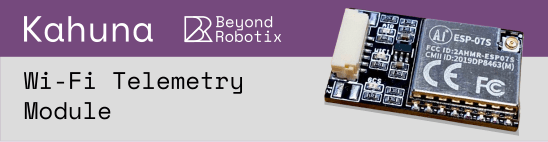
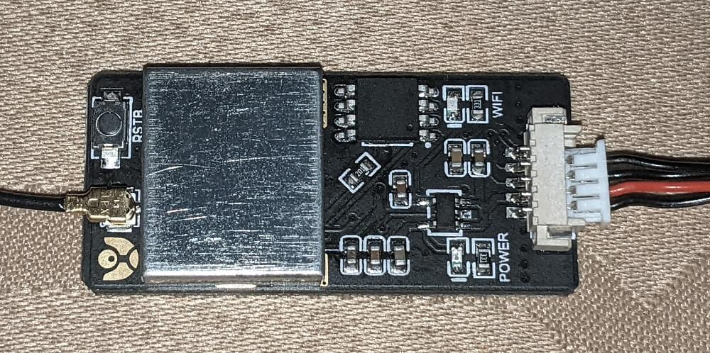
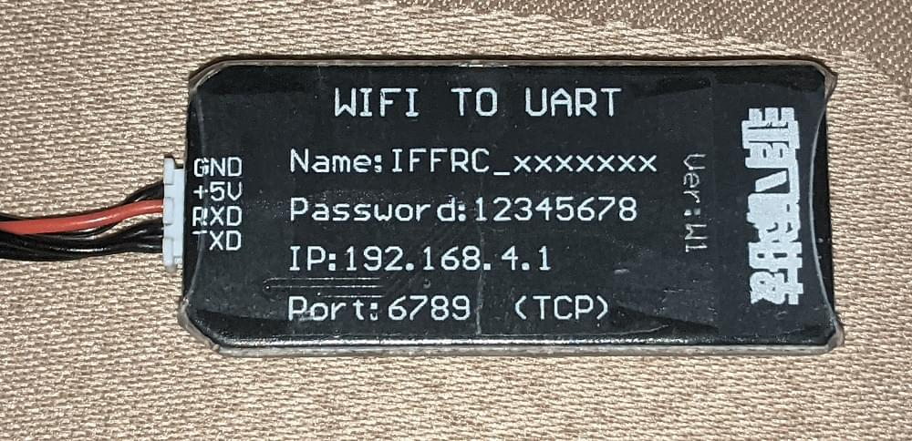
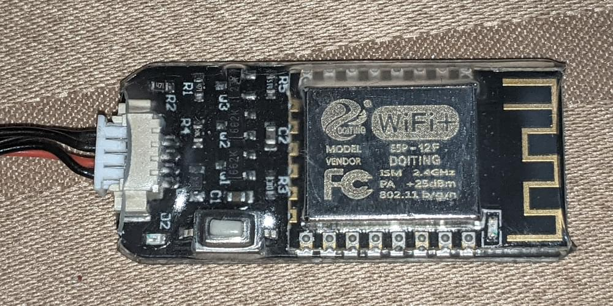
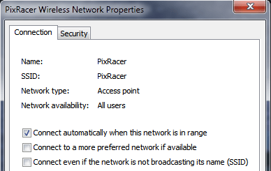
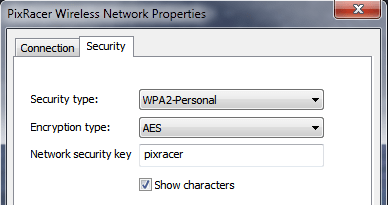
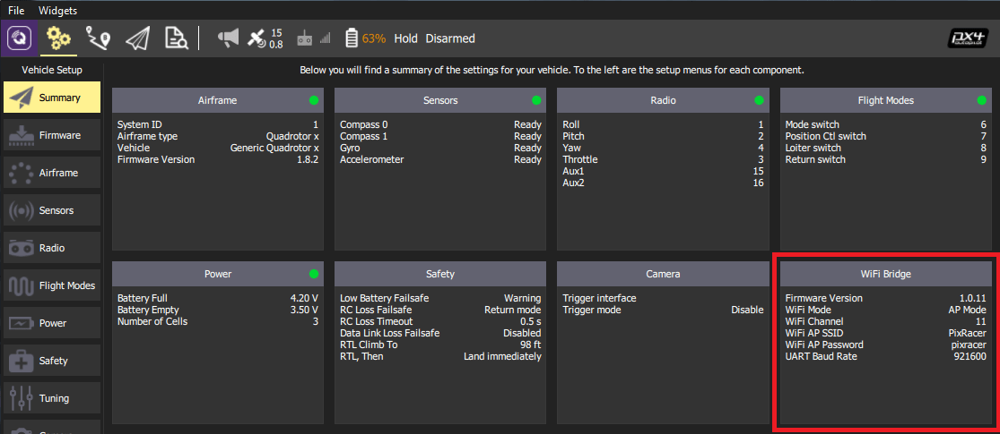
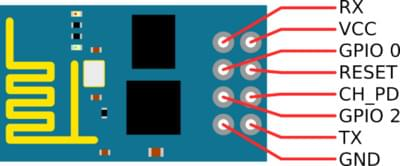
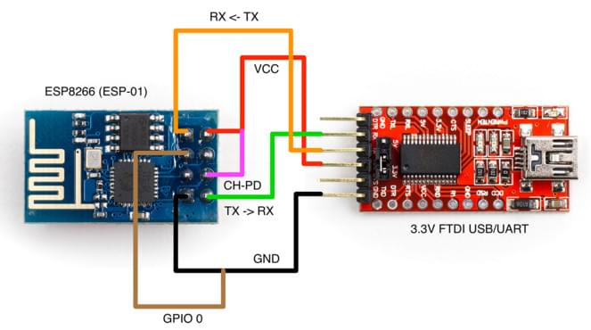

# ESP8266 WiFi 模块

The ESP8266 and its clones are low-cost and readily available Wi-Fi modules with full TCP/IP stack and microcontroller capability.
They can be used with any Pixhawk series controller.

:::tip
ESP8266 is the _defacto_ default WiFi module for use with [Pixracer](../flight_controller/pixracer.md) (and is usually bundled with it).
:::

## 购买渠道

The ESP8266 module is readily available from a number of suppliers.
A few vendors are listed below.

Most modules support 3.3 V input (only), while some flight controllers (e.g. Pixhawk 4) output at 5V (you will need to check compatibility and step down the voltage if needed).

Modules that accept 3.3V supply:

- [WRL-17146](https://www.sparkfun.com/products/13678) (Sparkfun)
- [AI Cloud](https://us.gearbest.com/boards-shields/pp_009604906563.html) - discontinued (GearBeast)

Modules that accept 5.0V supply:

- [AI Thinker](https://www.banggood.com/Wireless-Wifi-to-Uart-Telemetry-Module-With-Antenna-for-Mini-APM-Flight-Controller-p-1065339.html) (Banggood)
- [AlphaUAVLink](https://www.banggood.com/MAVLink-Wifi-Bridge-2_4G-Wireless-Wifi-Telemetry-Module-with-Antenna-for-Pixhawk-APM-Flight-Controller-p-1428590.html) (Banggood)
- [Kahuna](https://www.beyondrobotix.com/products/kahuna?utm_source=px4-esp8266-docs) (Beyond Robotix)

  A plug and play ESP8266 module.

  The Kahuna comes with a cable to connect directly to the Pixhawk-standard `TELEM1` or `TELEM2` ports.
  It is pre-flashed with the latest firmware, and has a u.fl connector for an external antenna.
  At most you may need to set the baud rate parameter, which for `TELEM1` is `SER_TEL1_BAUD = 57600 (57600 8N1)`.
  The User Guide include WiFi setup and other relevant information.

  

## Pixhawk/PX4 Setup & Configuration {#px4_config}

:::tip
You _may_ first need to update the radio with PX4-compatible ESP8266 firmware ([see below](#esp8266-flashing-firmware-advanced)).
The manufacture instructions should explain if this is needed.
:::

Connect your ESP8266 to your Pixhawk-series flight controller (e.g. Pixracer) on any free UART.

Connect the flight controller to your ground station via USB (as WiFi is not yet fully set up).

使用 _QGroundControl_:

- [Load recent PX4 firmware onto the flight controller](../config/firmware.md).
- [Configure the serial port](../peripherals/serial_configuration.md) used to connect the ESP8266.
  Remember to set the baud rate to 921600 in order to match the value set for the ESP8266.
- [Configure MAVLink](../peripherals/mavlink_peripherals.md) on the corresponding serial port in order to receive telemetry and transmit commands over the ESP8266.

Once you have configured the flight controller serial port used for connecting to the radio, you can remove the physical USB connection between the ground station and the vehicle.

## Connect via ESP8266 to QGC

The module exposes a WiFi hotspot that your ground station computer can use to connect to the vehicle.

:::info
The settings for the ESP8266 hotspot should be provided with the board (e.g. typically printed on the reverse side of the board or on the packaging).

A common factory network setting is:

- **SSID:** PixRacer
- **Password:** pixracer
- **WiFi Channel:** 11
- **UART speed:** 921600

Other modules may use settings like this:

- **SSID:** IFFRC_xxxxxxxx
- **Password:** 12345678
- **IP:** 192.168.4.1
- **Port:** 6789 (TCP)

Examples of boards from AlphaUILink and DOITING are shown below:

   
:::

On your wifi-enabled _QGroundControl_ ground station computer/tablet, find and connect to the open wireless network for your ESP8266.
On a Windows computer the connection settings for a network with name **Pixracer** and default password **pixracer** point will look like this:




_QGroundControl_ will automatically connect to the vehicle when the ground station computer is attached to a WiFi access point named "Pixracer".

If you're using a module with any other WiFi name you will need to manually set up the QGroundControl WiFi connection, as shown in the following section.

## Configure QGC with non-standard WiFi connections

_QGroundControl_ will automatically connect to the vehicle when the ground station computer is attached to the "Pixracer" WiFi access point.
For any other access point name you will need to manually create a custom comm link:

1. Go to [Application Settings > Comm Links](https://docs.qgroundcontrol.com/master/en/qgc-user-guide/settings_view/settings_view.html)
2. Add new connection with appropriate settings.
3. Select the new connection, and click **Connect**.
4. The vehicle should now connect

## Verify

You should now see HUD movement on your QGC computer via wireless link and be able to view the summary panel for the ESP8266 WiFi Bridge (as shown below).



:::tip
If you have any problem connecting, see [QGC Usage Problems](https://docs.qgroundcontrol.com/master/en/qgc-user-guide/troubleshooting/qgc_usage.html).
:::

## ESP8266 Flashing/Firmware (Advanced)

ESP8266 modules from different manufacturers may not have appropriate ESP8266 firmware pre-installed.
The instructions below explain how to update radios with the correct version.

### Pre Built Binaries

[MavLink ESP8266 Firmware V 1.2.2](http://www.grubba.com/mavesp8266/firmware-1.2.2.bin)

### Build From Sources

The [firmware repository](https://github.com/dogmaphobic/mavesp8266) contains instructions and all the tools needed for building and flashing the ESP8266 firmware.

### Updating the Firmware OTA

If you have firmware 1.0.4 or greater installed, you can do the update using the ESP's _Over The Air Update_ feature.
Just connect to its AP WiFi link and browse to: `http://192.168.4.1/update`.
You can then select the firmware file you downloaded above and upload it to the WiFi Module.

:::tip
This is the easiest way to update firmware!
:::

### Flashing the ESP8266 Firmware

Before flashing, make sure you boot the ESP8266 in _Flash Mode_ as described below.
If you cloned the [MavESP8266](https://github.com/dogmaphobic/mavesp8266) repository, you can build and flash the firmware using the provided [PlatformIO](http://platformio.org) tools and environment.
If you downloaded the pre-built firmware above, download the [esptool](https://github.com/espressif/esptool) utility and use the command line below:

```sh
esptool.py --baud 921600 --port /dev/your_serial_port write_flash 0x00000 firmware_xxxxx.bin
```

Where:

- **firmware_xxxxx.bin** is the firmware you downloaded above
- **your_serial_port** is the name of the serial port where the ESP8266 is connected to (`/dev/cu.usbmodem` for example)

### 下载固件接线

:::warning
Most ESP8266 modules support 3.3 volts (only), while some flight controllers (e.g. Pixhawk 4) output at 5V.
Check compatibility and step down the voltage if needed.
:::

There are various methods for setting the ESP8266 into _Flash Mode_ but not all USB/UART adapters provide all the necessary pins for automatic mode switching.
In order to boot the ESP8266 in _Flash Mode_, the GPIO-0 pin must be set low (GND) and the CH_PD pin must be set high (VCC).
This is what my own setup looks like:


I built a cable where RX, TX, VCC, and GND are properly wired directly from the FTDI adapter to the ESP8266.
From the ESP8266, I left two wires connected to GPIO-0 and CH_PD free so I can boot it either normally or in flash mode by connecting them to GND and VCC respectively.

#### ESP8266 (ESP-01) Pinout



#### Flashing Diagram using an FTDI USB/UART Adapter


