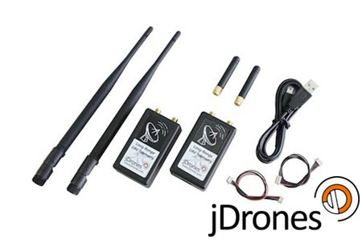

# RFD900长距离数传

[jDrones](http://store.jDrones.com) and [RFDesign](http://rfdesign.com.au/) offer _long-range_ [SiK](../telemetry/sik_radio.md)-compatible telemetry radios.
这个电台配合普通天线可以提供最少5公里的稳定链接。

:::tip
_jDrones_ have productized _RFDesign_ modems (added a casing with power management, filtering and other electronics inside, along with cables to connect to popular flight controllers, and individually validated antennas).
The first such modem was the _RFD900_, but both _RFDesign_ and _jDrones_ have since iterated to new versions.
:::

The _jDrones_ radios have a JST-GH connector, and come with cables for: _JST-GH to JST-GH_ and _JST-GH to DF-13_. They can therefore be used in a "plug-n-play" way with most [Pixhawk Series](../flight_controller/pixhawk_series.md) controllers (you might have to change/use an appropriate connector for some "non-standard" boards).

There are a number of versions available:

- [jD-RF900Plus Longrange (900Mhz)](http://store.jdrones.com/jD_RD900Plus_Telemetry_Bundle_p/rf900set02.htm) (USA)
- [jD-RF868Plus Longrange (868Mhz)](http://store.jdrones.com/jD_RD868Plus_Telemetry_Bundle_p/rf868set02.htm) (Europe)
- [store.rfdesign.com.au](https://store.rfdesign.com.au/radio-modems/):
  - [RFD 900+ Modem](https://store.rfdesign.com.au/rfd-900p-modem/)
  - [RFD 868x Modem (EU)](https://store.rfdesign.com.au/rfd868x-eu-hs-8517-62-00-90/)
  - [RFD900x](https://store.rfdesign.com.au/rfd-900x-modem-hs-8517-62-00-90/)
