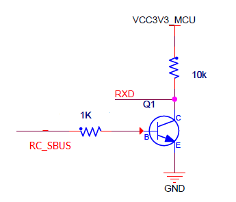
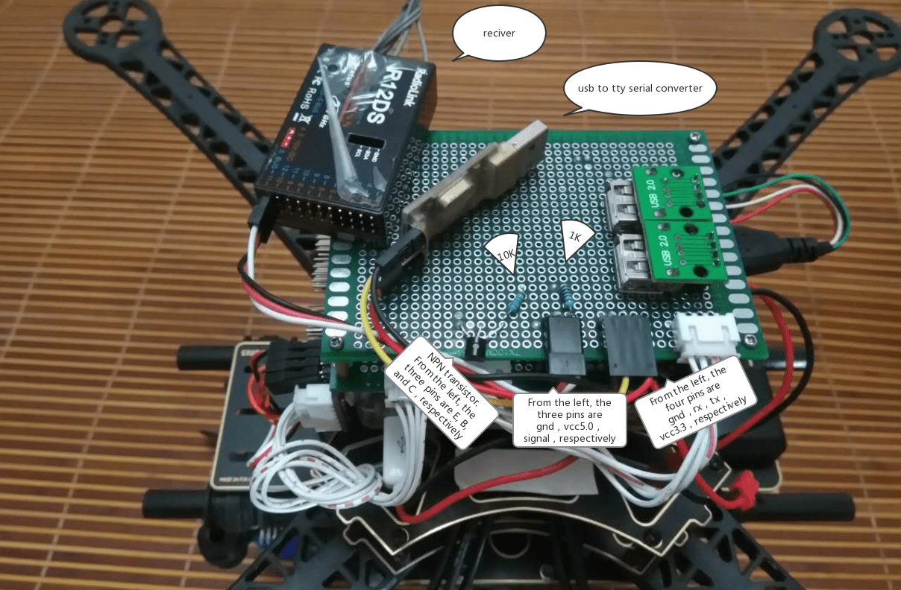

# 将RC接收器连接到基于PX4 Linux的自动驾驶仪

This topic shows how to setup a PX4 Linux-based autopilot to connect and use a [supported RC receiver](../getting_started/rc_transmitter_receiver.md) on any serial port.

对于S.Bus以外的遥控类型，您可以将接收器直接连接到串口，或者使用USB转TTY串行线（例如 PL2302 USB转串行TTL转换器）。

:::info
For an S.Bus receiver (or encoder - e.g. from Futaba, RadioLink, etc.) you will usually need to connect the receiver and device via a [signal inverter circuit](#signal_inverter_circuit), but otherwise the setup is the same.
:::

Then [Start the PX4 RC Driver](#start_driver) on the device, as shown below.

<a id="start_driver"></a>

## 启动驱动程序

To start the RC driver on a particular UART (e.g. in this case `/dev/ttyS2`):

```sh
linux_sbus start|stop|status -d &lt;device&gt; -c &lt;channel&gt;
```

For other driver usage information see: [rc_input](../modules/modules_driver.md#rc-input).

<a id="signal_inverter_circuit"></a>

## 信号反相器电路 (仅限S.Bus)

S.Bus is an _inverted_ UART communication signal.

虽然一些串行端口/飞行控制器可以读取反转的 UART 信号，但大多数需要在接收器和串行端口之间使用信号反相器电路来反转信号。

:::tip
This circuit is also required to read S.Bus remote control signals through the serial port or USB-to-TTY serial converter.
:::

本节介绍如何创建合适的电路。

### 所需组件

- 1x NPN 晶体管（例如 NPN S9014 TO92）
- 1x 10K 电阻
- 1x 1K 电阻

:::info
Any type/model of transistor can be used because the current drain is very low.
:::

### 电路图/连接

按如下所述（也显示在电路图中）连接组件：

- S.Bus 信号&rarr;1K 电阻&rarr;NPN 晶体管
- NPN晶体管发射极&rarr; GND
- 3.3VCC＆&rarr; 10K电阻&rarr; NPN晶体管集电极&rarr; USB-to-TTY的RXD
- 5.0VCC&rarr;S.Bus VCC
- GND &rarr; S.Bus GND



下面的图片显示了面包板上的连接。


