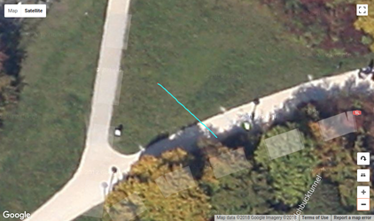
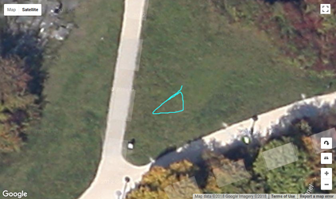
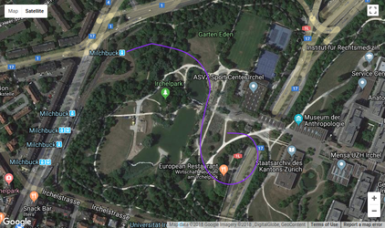
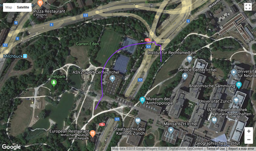
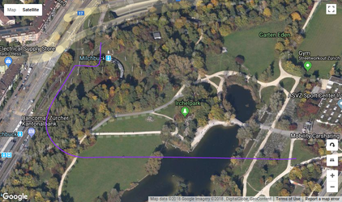

| Test Name  | Description | Image |
| ------------- | ------------- | ------------- |
| [multirotor_box.mission](multirotor_box.mission "multirotor box") | Simple multirotor box mission. [Example](https://logs.px4.io/plot_app?log=c950b7f7-86cb-4b89-8674-b0f46265b823) |  |
| Offboard Attitude | Offboard attitude test with ROS. [Example](https://logs.px4.io/plot_app?log=17a5dbd3-c1a8-4d2e-97e5-bf81de048baf) |  |
| Offboard Position | Offboard position test with ROS. [Example](https://logs.px4.io/plot_app?log=2194941e-05e8-4aa0-a7fa-aab645c57126) |  |
| [vtol_new_1.txt](vtol_new_1.txt "vtol new 1")  | Standard VTOL transition mission new 1. [Example](https://logs.px4.io/plot_app?log=3babe543-28a2-484d-8bcc-bd726841b69f) |  |
| [vtol_new_2.txt](vtol_new_2.txt "vtol new 2")  | Standard VTOL transition mission new 2. [Example](https://logs.px4.io/plot_app?log=644a91ee-8390-4ab7-a824-f164010f6628) |  |
| [vtol_old_1.txt](vtol_old_1.txt "vtol old 1")  | Standard VTOL transition mission old 1. [Example](https://logs.px4.io/plot_app?log=54a731c3-43e9-41cb-8ab3-3bd75c5727b8) |  |
| [vtol_old_2.txt](vtol_old_2.txt "vtol old 2")  | Standard VTOL transition mission old 2. [Example](https://logs.px4.io/plot_app?log=2b04575f-b7ae-43e7-ae63-29c613e3d913) |  |

