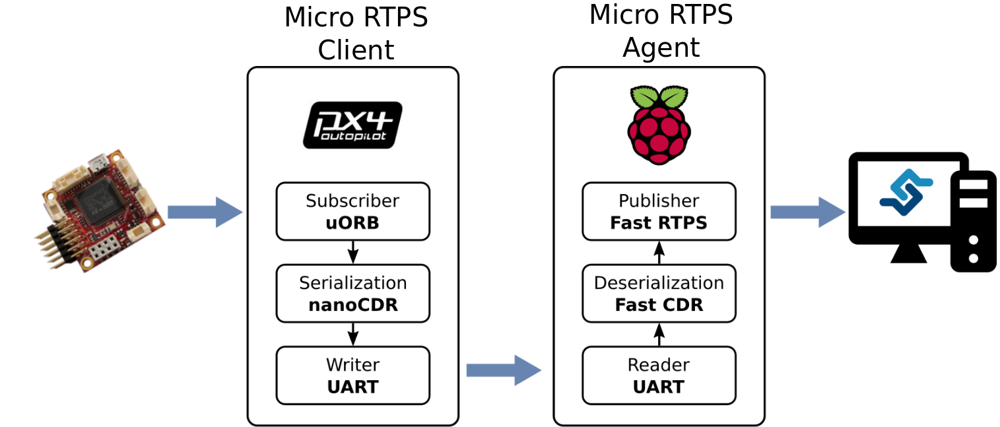

# RTPS/ROS2 interface: the PX4-FastRTPS bridge

This bridge adds communication capabilities between a *PX4 Autopilot* and a *Fast RTPS* application, through serial ports or
UDP sockets, using [CDR serialization](https://en.wikipedia.org/wiki/Common_Data_Representation). The goal is to provide a RTPS (Real Time Publish Subscribe Protocol) interface to PX4. This interface will also allow sharing information with the forthcoming release of ROS2 (Robot Operating System).

RTPS is the underlying protocol of DDS, an standard from the OMG (Object Management Group) providing a real-time publish/subscribe middleware that is widely used in aerospace, defense and IoT applications. It has also been adopted as the middleware for the ROS2 robotics toolkit.

Fast RTPS implements the latest version of the RTPS protocol and a minimum DDS API, resulting in a very lightweight implementation of the standard and full access to the RTPS fine settings.

## Code generation

Support for the functionality is mainly implemented within three new (automatically generated) code blocks:

- *CDR serialization functions* are generated for specified uORB topics (those that are to be sent/received). For example, the following functions are generated for the *sensor_combined.msg*:

  ```sh
  void serialize_sensor_combined(const struct sensor_combined_s *input, char *output, uint32_t *length, struct microCDR *microCDRWriter);
  void deserialize_sensor_combined(struct sensor_combined_s *output, char *input, struct microCDR *microCDRReader);
  ```

  > **Note** *CDR serialization* provides a common format for exchanging serial data between different platforms.  

- A *client application* that sends and receives the CDR serialized data from topics through a selected UART or UDP port.

- An *agent application* that shares the CDR serialized data via (using **Fast RTPS**) to DDS service clients (e.g. ROS2). A first step in this part is the generation of a IDL file for each topic which is the translation of the corresponding MSG file (For the case of *sensor_combined* topic the **sensor_combined_.idl** file is generated from **sensor_combined.msg** file). After that *fastrtpsgen* tool is capable to generate code from the IDL file.

These pieces of code are generated within the normal PX4 Firmware generation process. They can also can be generated explicitly by calling the script **Tools/generate_microRTPS_bridge.py** (see section below).

### Automatically generate client and the agent code

> **Note** Before continuing we need to have [installed Fast RTPS](https://dev.px4.io/en/setup/fast-rtps-installation.html).

The code needed for the client, agent, and CDR serialization is automatically generated when the PX4 Firmware is compiled. The actual functions generated is based the uORB topics to send and receive. These are listed in the **.cmake** file (**cmake/configs**) for each target platform:

```cmake
set(config_rtps_send_topics
   sensor_accel
   sensor_baro
   sensor_gyro
   # Add new topic...
   )

set(config_rtps_receive_topics
   sensor_combined
   telemetry_status
   wind_estimate
   # Add new topic...
   )
```

> **Note** Before compiling ensure that the code generation is not disabled in this way:
```sh
set(GENERATE_RTPS_BRIDGE off)
```

The client application will be generated in *build_OURPLATFORM/src/modules/micrortps_bridge/micrortps_client/* folder and the agent will be created in *src/modules/micrortps_bridge/micrortps_agent/* folder.

> **Note** In the process of the agent generation we use a Fast RTPS tool called *fastrtpsgen*. If you haven't installed Fast RTPS in the default path you need to specify the directory of installation of *fastrtpsgen* setting the environment variable `FASTRTPSGEN_DIR` before executing *make*.
> On Linux/Mac this is done as shown below:
>
>  ```sh
  export FASTRTPSGEN_DIR=/path/to/fastrtps/install/folder/bin
  ```

### Manually generate client and agent code

It is also possible to generate and install the code for the client and the agent outside the normal PX4 build process using the python script
**Tools/generate_microRTPS_bridge.py**.

First at all, we need to disable the automatic generation in the PX4 compiling process setting the variable `GENERATE_RTPS_BRIDGE` to *off* inside the *.cmake* file for the target platform:

```sh
set(GENERATE_RTPS_BRIDGE off)
```

The tool's command syntax is shown below:

```sh
$ cd /path/to/PX4/Firmware
$ python Tools/generate_microRTPS_bridge.py -h
usage: generate_microRTPS_bridge.py [-h] [-s *.msg [*.msg ...]]
                                    [-r *.msg [*.msg ...]] [-a] [-c]
                                    [-t MSGDIR] [-o AGENTDIR] [-u CLIENTDIR]
                                    [-f FASTRTPSGEN]

optional arguments:
  -h, --help            show this help message and exit
  -s *.msg [*.msg ...], --send *.msg [*.msg ...]
                        Topics to be sent
  -r *.msg [*.msg ...], --receive *.msg [*.msg ...]
                        Topics to be received
  -a, --agent           Flag for generate the agent, by default is true if -c
                        is not specified
  -c, --client          Flag for generate the client, by default is true if -a
                        is not specified
  -t MSGDIR, --topic-msg-dir MSGDIR
                        Topics message dir, by default msg/
  -o AGENTDIR, --agent-outdir AGENTDIR
                        Agent output dir, by default
                        src/modules/micrortps_bridge/micrortps_agent
  -u CLIENTDIR, --client-outdir CLIENTDIR
                        Client output dir, by default
                        src/modules/micrortps_bridge/micrortps_client
  -f FASTRTPSGEN, --fastrtpsgen-dir FASTRTPSGEN
                        fastrtpsgen installation dir, by default /bin
  --delete-tree         Delete dir tree output dir(s)
```
  > **Caution with --delete-tree option** so erases the content of the `CLIENTDIR` and the `AGENTDIR` before creating new files and folders.

- The argument `--send/-s` means that the application from PX4 side will send these messages, and the argument `--receive/-r` specifies which messages are going to be received.
- The output appears in `CLIENTDIR` (`-o src/modules/micrortps_bridge/micrortps_client`, by default) and in the `AGENTDIR` (`-u src/modules/micrortps_bridge/micrortps_agent`, by default).
- If no flag `-a` or `-c` is specified, both the client and the agent will be generated and installed.
- The `-f` option may be needed if *Fast RTPS* was not installed in the default location (`-f /path/to/fastrtps/installation/bin`).

An example of use:

```sh
$ cd /path/to/PX4/Firmware
$ python Tools/generate_microRTPS_bridge.py -s msg/sensor_baro.msg -r msg/sensor_combined.msg
```

Checking the correct generation and installation:

```sh
$ tree src/modules/micrortps_bridge/micrortps_agent
src/modules/micrortps_bridge/micrortps_agent
├── build
├── CMakeLists.txt
├── idl
│   ├── sensor_baro_.idl
│   └── sensor_combined_.idl
├── microRTPS_agent.cpp
├── microRTPS_transport.cpp
├── microRTPS_transport.h
├── RtpsTopics.cpp
├── RtpsTopics.h
├── sensor_baro_.cpp
├── sensor_baro_.h
├── sensor_baro_Publisher.cpp
├── sensor_baro_Publisher.h
├── sensor_baro_PubSubTypes.cpp
├── sensor_baro_PubSubTypes.h
├── sensor_combined_.cpp
├── sensor_combined_.h
├── sensor_combined_PubSubTypes.cpp
├── sensor_combined_PubSubTypes.h
├── sensor_combined_Subscriber.cpp
└── sensor_combined_Subscriber.h
 2 directories, 20 files
```

```sh
$ tree src/modules/micrortps_bridge/micrortps_client
src/modules/micrortps_bridge/micrortps_client
├── CMakeLists.txt
├── microRTPS_client.cpp
├── microRTPS_transport.cpp
└── microRTPS_transport.h
 0 directories, 4 files
```


## PX4 Firmware side: the micro RTPS client

The client application runs as both a uORB node and as a micro RTPS node. As a uORB node the agent could be subscribed to several topics as well as publish under internal uORB topics. The application receives from a internal publishers the messages, serializes the struct and writes it trough an UART
device or UDP port selected by the user. Also will be reading from the UART device or UDP port and then publish the info
to the internal subscribers.

Steps to use the auto generated application:

- Check that the lines **modules/micrortps_bridge/micrortps_client** and **lib/micro-CDR** are present in the *.cmake* config file for the target platform (*cmake/configs/*). This enables the compilation of the client along with the **PX4** firmware:

  ```sh
  set(config_module_list
      ...
      lib/micro-CDR
      ...
      # micro RTPS
      modules/micrortps_bridge/micrortps_client
      ...
      )
  ```
  > **Note** For Nuttx platforms (e.g. *Pixracer*) the cmake files are **cmake/configs/nuttx_px4fmu-v4_default.cmake**. For the *Snapdragon Flight* platform you can find the cmake configuration here: **cmake/configs/posix_sdflight_default.cmake**.

- Construct and upload the firmware executing, for example:

  ```sh
  # For NuttX/Pixhawk flight controllers:
  $ make px4fmu-v4_default upload
  ```
  ```sh
  # For Snapdragon Flight:
  $ make eagle_default upload
  ```

After uploading the firmware, the application can be launched typing its name and passing an variable number of arguments as shown below:

```sh
> micrortps_client start|stop [options]
  -t <transport>          [UART|UDP] Default UART
  -d <device>             UART device. Default /dev/ttyACM0
  -u <update_time_ms>     Time in ms for uORB subscribed topics update. Default 0
  -l <loops>              How many iterations will this program have. -1 for infinite. Default 10000
  -w <sleep_time_ms>      Time in ms for which each iteration sleep. Default 1ms
  -b <baudrate>           UART device baudrate. Default 460800
  -p <poll_ms>            Time in ms to poll over UART. Default 1ms
  -r <reception port>     UDP port for receiving. Default 2019
  -s <sending port>       UDP port for sending. Default 2020
```

> **Note** When working with a USB-serial adapter the maximum link speed is used (the `-b` option is ignored).
  ```sh
  > micrortps_client start #by default -t UART -d /dev/ttyACM0 -u 0 -l 10000 -w 1 -b 460800 -p 1
  ```

<span></span>
> **Note** If the selected UART port is busy, it's possible that the MAVLink application is already being used. If it is the case, you can stop MAVLink from NuttShell by typing:
  ```sh
  > mavlink stop-all
  ```

## Fast RTPS side: the Micro RTPS agent

The application has several functions and possibilities of use: get the sensor data from a system that is using the *PX4
Firmware* (obtaining the information from the selected transport: UDP or UART), publish this to a *Fast RTPS* environment
and, in the other direction, to send through the selected transport the information of topics that are expected in the
*PX4* side with the info even from subscribed messages from *Fast RTPS* side.

> **Note** Before running the application, you must [install Fast RTPS](https://dev.px4.io/en/setup/fast-rtps-installation.html).

This section explains how create *Fast RTPS* applications using the files generated by **generate_microRTPS_bridge.py** and **fastrtpsgen** (this step performed inside install script) from *Fast RTPS*.

On the *Fast RTPS* side, it will be used an application running as a Fast RTPS node and as a micro RTPS node at same time. This application allow to launch RTPS publishers and subscribers that will be using the information coming from and sending to uORB topics in the PX4 side thanks to the autogenerated idl file from the original msg file. The publisher will read data from UART/UDP, deserializes it, and make a Fast RTPS message mapping the attributes from the uORB message. The subscriber simply receives the Fast RTPS messages and send in the reverse sequence to the PX4 side. The subscriber can be launched on the Raspberry Pi or in any another device connected in the same network.

To create the application, compile the code:

  ```sh
  $ cd src/modules/micrortps_bridge/microRTPS_agent
  $ mkdir build && cd build
  $ cmake ..
  $ make
  ```

> **Note** To cross-compile for the Qualcomm Snapdragon Flight platform see [this link](https://github.com/eProsima/PX4-FastRTPS-PoC-Snapdragon-UDP#how-to-use).

To launch the publisher run:

  ```text
  $ ./micrortps_agent [options]
    -t <transport>          [UART|UDP] Default UART
    -d <device>             UART device. Default /dev/ttyACM0
    -w <sleep_time_us>      Time in us for which each iteration sleep. Default 1ms
    -b <baudrate>           UART device baudrate. Default 460800
    -p <poll_ms>            Time in ms to poll over UART. Default 1ms
    -r <reception port>     UDP port for receiving. Default 2019
    -s <sending port>       UDP port for sending. Default 2020
  ```
  > **Note** If we are working with a USB-serial adapter the **-b** option will be ignored and will be working at maximum speed of the link.
  ```sh
  $ ./micrortps_agent # by default -t UART -d /dev/ttyACM0 -w 1 -b 460800 -p 1
  ```


## Creating a Listener

Now that we have the Client running on the flight controller and the Agent on an offboard computer, we can create an application to communicate with the flight controller through FastRTPS. The *fastrtpsgen* script allows us to quickly generate a simple application from a IDL message file. We will use it to create a Listener which subscribes to the sensor_combined topic. The Listener can be run on any computer on the same network as the Agent, but here they will be on the same computer.

```sh
$ cd /path/to/PX4/Firmware/src/modules/micrortps_bridge
$ mkdir micrortps_listener
$ cd micrortps_listener
$ fastrtpsgen -example x64Linux2.6gcc ../micrortps_agent/idl/sensor_combined_.idl
```

This creates a sample subscriber, a publisher and a main-application to run them. To print out the data from the sensor_combined topic we modify the onNewDataMessage-method in sensor_combined_Subscriber.cxx:

```sh
void sensor_combined_Subscriber::SubListener::onNewDataMessage(Subscriber* sub)
{
    // Take data
    sensor_combined_ st;

    if(sub->takeNextData(&st, &m_info))
    {
        if(m_info.sampleKind == ALIVE)
        {
            // Print your structure data here.
            ++n_msg;
            std::cout << "\n\n\n\n\n\n\n\n\n\n";
            std::cout << "Sample received, count=" << n_msg << std::endl;
            std::cout << "=============================" << std::endl;
            std::cout << "gyro_rad: " << st.gyro_rad().at(0);
            std::cout << ", " << st.gyro_rad().at(1);
            std::cout << ", " << st.gyro_rad().at(2) << std::endl;
            std::cout << "gyro_integral_dt: " << st.gyro_integral_dt() << std::endl;
            std::cout << "accelerometer_timestamp_relative: " << st.accelerometer_timestamp_relative() << std::endl;
            std::cout << "accelerometer_m_s2: " << st.accelerometer_m_s2().at(0);
            std::cout << ", " << st.accelerometer_m_s2().at(1);
            std::cout << ", " << st.accelerometer_m_s2().at(2) << std::endl;
            std::cout << "accelerometer_integral_dt: " << st.accelerometer_integral_dt() << std::endl;
            std::cout << "magnetometer_timestamp_relative: " << st.magnetometer_timestamp_relative() << std::endl;
            std::cout << "magnetometer_ga: " << st.magnetometer_ga().at(0);
            std::cout << ", " << st.magnetometer_ga().at(1);
            std::cout << ", " << st.magnetometer_ga().at(2) << std::endl;
            std::cout << "baro_timestamp_relative: " << st.baro_timestamp_relative() << std::endl;
            std::cout << "baro_alt_meter: " << st.baro_alt_meter() << std::endl;
            std::cout << "baro_temp_celcius: " << st.baro_temp_celcius() << std::endl;

        }
    }
}

```

Now build and run the Listener:

```sh
$ make -f makefile_x64Linux2.6gcc
$ bin/*/sensor_combined_PublisherSubscriber subscriber
```

Now you should see the alititude being printed out by the Listener

```sh
Sample received, count=10119
Received sensor_combined data
=============================
gyro_rad: -0.0103228, 0.0140477, 0.000319406
gyro_integral_dt: 0.004
accelerometer_timestamp_relative: 0
accelerometer_m_s2: -2.82708, -6.34799, -7.41101
accelerometer_integral_dt: 0.004
magnetometer_timestamp_relative: -10210
magnetometer_ga: 0.60171, 0.0405879, -0.040995
baro_timestamp_relative: -17469
baro_alt_meter: 368.647
baro_temp_celcius: 43.93
```

If the Listener does not print anything, make sure the Client is running. By default the Client runs for 10000 and than stops, to run the Client continuously run
```sh
$ micrortps_client start -l -1
```


## Throughput test

[Throughput test](throughput_test.md) show some real-world examples of how to use the features described in this topic.


## Troubleshooting

### Extra steps for Raspberry Pi

> **Note** Normally, for UART transport it's necessary set up the UART port in the Raspberry Pi. To enable the serial port available on Raspberry Pi connector:

1. Make sure the `userid` (default is pi) is a member of the `dialout` group:

  ```sh
  $ groups pi
  $ sudo usermod -a -G dialout pi
  ```

2. You need to stop the already running on the GPIO serial console:

  ```sh
  $ sudo raspi-config
  ```

  In the menu showed go to **Interfacing options > Serial**. Select **NO for *Would you like a login shell to be accessible over serial?*. Valid and reboot.

3. Check UART in kernel:

  ```sh
  $ sudo vi /boot/config.txt
  ```

And enable UART setting `enable_uart=1`.


## Graphical example of usage

This flow chart shows graphically how the bridge works. It demonstrates a bridge that sends the topic `sensor_combined` from a Pixracer to a Raspberry Pi through UART.


